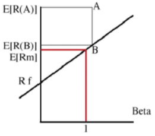

```{r, message=FALSE, echo=FALSE, include=F}
library("quantmod")
library("forecast")
library("xts")
library("dplyr")
library("gridExtra")
library("dynlm")
library("ggplot2")
library("reshape2")
library("knitr")
library("tseries")
library("MASS")
library("car")
library("sandwich")
library("lmtest")
```

\begin{titlepage}

\centerline{\bf \large Vilniaus Universitetas}
\bigskip
\centerline{\large \textbf{Matematikos ir informatikos fakultetas}}

\vskip 120pt
\centerline{\bf \Large \textbf{Kursinis darbas}}
\vskip 50pt
\begin{center}
    {\bf \LARGE Lietuvos akcijų rinkos grąžos priklausomybė nuo makroekonominių duomenų}
\end{center}
\bigskip
\centerline{\Large \textbf{Kursinio vadovas: lektorius dr. Dmitrij Celov}}
\bigskip
\centerline{\Large \textbf{Darbą atliko: Manvydas Sokolovas ir Paulius Kostickis}}
\vskip 90pt
\vskip 120pt
\centerline{\large \textbf{VILNIUS 2016}}
%\newpage
\end{titlepage}

\textwidth 6.5in
\textheight 9.00in

\renewcommand{\contentsname}{Turinys}
\tableofcontents
\thispagestyle{empty}
\newpage

#Santrauka:

&nbsp;&nbsp;&nbsp;&nbsp;&nbsp; Makroekonomiai rodikliai gali padėti nuspėti ateities verslo ciklą, kuris turi įtakos akcijų pelningumui. Sudarytas „OMX Vilnius“ indekso grąžos prognozavimo modelis naudojant arbitražo įkainojimo teoremą (angl. APT), siekiant išsiaiškinti, kokie Lietuvos makroekonominiai rodikliai tiesiškai paveikia „OMX Vilnius“ indekso grąžas. Sukurta pelninga strategija remiantis Lietuvos makro rodikliais ir palyginta su atsitiktiniu investavimu. Tirti mėnesiniai duomenys nuo 2002 iki 2016 metų. Dalis makroekonominių rodiklių yra reikšmingi vertinant indekso kainos pokyčius. 

*Darbe naudojami trumpiniai:*

kk – kasyba ir karjerų eksploatacija
\newline mp – mažmeninė prekyba
\newline vp – verslo plėtros aktyvumas per 3 mėnesius
\newline ta – turimos akcijos
\newline ul – užsakymų lūkesčiai
\newline dll – darbo lygio lūkesčiai
\newline mhope – mažmeninės prekybos pasitikėjimas
\newline shope – statybų pasitikėjimas
\newline phope – paslaugų pasitikėjimas
\newline vhope – vartotojų pasitikėjimas
\newline pramhope – pramonės pasitikėjimas 
\newline gkl – gamintojų kainų lygis
\newline ip – industrinė produkcija

# Įvadas:
&nbsp;&nbsp;&nbsp;&nbsp;&nbsp; Akcijų pokyčiams yra reikšminga ekonomikos būsena. Jei ekonomika auga, tuomet dauguma įmonių padidina savo pelną ir gamybą. Priešingas procesas, kai ekonomika traukiasi. Egzistuoja makroekonominiai rodikliai tokie kaip infliacija, valiutos kursas, palūkanų dydis, kurie gali paaiškinti akcijų grąžas. Tačiau yra atliktas tyrimas Rusijos rinkoje, remiantis arbitražo įkainojimo teorija, kurio tyrimo autorius nesugebėjo rasti reikšmingos makroekonominių duomenų  įtakos akcijų grąžoms. O Šri Lankos ir Indijos rinkoms atlikti empiriniai tyrimai parodė, jog makroekonominiai rodikliai turi įtakos akcijų grąžai. Todėl nutarta ištirti Lietuvos akcijų rinkos grąžos priklausomybę nuo makro rodiklių remiantis arbitražo įkainojimo teorija (angl. APT)  ir iš daugelių rodiklių atrinkti svarbiausius. 
Kylančiose rinkose daug dažniau pasitaiko neteisingai įkainotų finansinių instrumentų nei išvystytose (efektyviose) rinkose. Lietuvos rinką galime priskirti besivystančiosios rinkos kategorijai ir galbūt tyrimo išvadas, naudojant APT, galima bus praktiškai pritaikyti pelningai investuojant. 

# Teorija:

## Rizika ir diversifikavimas:

&nbsp;&nbsp;&nbsp;&nbsp;&nbsp; Investuojant į akcijas, kuo didesnis standartinis nuokrypis, tuo didesnė galimybė prarasti investuotus pinigus. Šiuo atveju rizika bus laikoma standartiniu nuokrypiu. Taigi rizika ir pajamos iš investicijų yra tiesiogiai tarpusavyje susijusios: kuo didesnė rizika, tuo turėtų būti didesnės laukiamas pelnas iš investicijų, kad jos kompensuotų aukštą rizikos lygį. Svarbus tampa reikalaujamas pelningumas – tai mažiausias laukiamas pelnas, kurio yra reikalaujama už investavimą į rizikingą aktyvą. Investuotojas gali rinktis nerizikingą pelną, pirkdamas nerizikingus vertybinius popierius. Ši nerizikinga pelno norma yra minimumas, kurio gali tikėtis investuotojas neprisiimdamas jokios rizikos. Pirkdamas rizikingesnį vertybinį popierių, investuotojas reikalaus rizikos premijos (atpildo už rizikingų vertybinių popierių laikymą. Taigi nerizikinga pelno norma bei rizikos premija sudaro reikalaujamą pelningumą. Ši priklausomybė pavaizduota paveiksle apačioje (figure 1).


H.Markowitz sukurta portfelio teorija leidžia investuotojams įvertinti riziką ir laukiamas pajamas. Galimą riziką sumažinti, o pelną padidinti, jei bus investuojama į skirtingas įmones, kurių akcijų kainos juda skirtingomis kryptimis. Diversifikacija eliminuoja nesisteminę riziką dėl dviejų priežasčių: atskiros įmonės akcijos sudaro nedidelę dalį portfelyje, todėl poveikis (tiek teigiamas, tiek neigiamas) mažai juntamas. Darbe remiamasi prielaida, jog galime diversifikuoti nesisteminę riziką, todėl bus tiriama tik sisteminės rizikos teikiamas premijas.

##Aktyvų įkainojimo modelis

&nbsp;&nbsp;&nbsp;&nbsp;&nbsp; CAPM – teorinis aktyvų įkainojimo modelis, nustatantis ryšį tarp laukiamo pelno ir rizikos konkurencinėje rinkoje. Nors šio modelio prielaidos yra labai griežtos, dažnai neatitinkančios realaus gyvenimo, yra bandoma testuoti modelį su realiais duomenimis.

$$\alpha, \beta,  \gamma, \Gamma$$

E(Y)-rf = $$\beta$$ * X

čia E(Y) - vidutinė akcijos grąža, rf - nerizikingo aktyvo grąža, $$\beta$$ - aktyvo rizikingumo jautrumas, X - visos rinkos grąža

Pagal CAPM, akcijos tikėtinos grąžos premija priklauso nuo rinkos rezultatų ir specifinės sisteminės rizikos nuo rinkos jautrumo dydžio.

Prielaidos yra tokios:

  Visi investuotojai vengia rizikos, kuri lygi portfelio pajamų (pelno) normos vidutiniam kvadratiniam nuokrypiui.

	Visi investuotojai turi vienodą laiko horizontą (pvz., vienas mėnuo, dveji metai) investiciniam sprendimui priimti.

	Visi investuotojai turi vienodą subjektyvų įvertį apie būsimą kiekvieną vertybinio popieriaus pelną ir riziką.

	Rinkoje egzistuoja nerizikingoji investicija į turtą, ir kiekvienas investuotojas gali skolintis arba skolinti neribotą jo kiekį su nerizikingąja palūkanų norma.

	Į visus vertybinius popierius kapitalą galima investuoti norimu santykiu, nėra išlaidų už sandorius, mokesčių bei apribojimų nepadengtajam pardavimui.

	Laisvai prieinama ir vienodai galima informacija apie investicijas visiems investuotojams.

	Nusistovėjusi kapitalo rinkos pusiausvyra, t.y. rinkos kainos yra kliringo kainos (kainos, pagal kurias vykdomi kasdieniniai atsiskaitymai kliringo kontoroje).

CAPM atveju dažniausiai beta(rizikos veiksnys) yra pasirenkamas tos pačios rinkos indeksas.
Prielaidos nėra realistiškos, tačiau ši teorija svarbi interpretuojant riziką, akcijų pelningumą.

##Arbitražinė aktyvų įkainojimo teorija (APT)
&nbsp;&nbsp;&nbsp;&nbsp;&nbsp; CAPM pagrindu buvo kuriami ir tobulinami kiti aktyvų įkainojimo modeliai, kurie galėjo turėti mažiau apribojimų ir prielaidų, taip pat turėti ir daugiau įtakojančių rodiklių. Vienas iš patobulintų CAPM yra arbitražinė aktyvų įkainojimo teorija(angl. APT).  1966 m. atsirado pirmosios arbitražo įkainojimo teorijos
idėjos, kai B. F. King (1966) pradėjo finansinių aktyvų grąžos pokyčius aiškinti ekonominiais duomenimis. Tačiau APT teorijos kūrėju yra laikomas S. A. Ross (1976), kuris pateikė  teorijai reikiamas prielaidas ir matematiškai pagrindė koncepciją. Šios teorijos pagrindas yra panašus, kaip ir CAPM, t. y. investuotojai reikalauja rizikos premijos už nediversifikuotos (sisteminės) rizikos prisisėmimą. Tačiau arbitražo įkainojimo teorijos naudingumas yra tas, jog galima įtraukti kitus sisteminės rizikos  šiame darbe yra tas, jog galime ištirti. Taip pat APT prielaidos yra paprastesnės ir realistiškesnės. 

APT taikymo prielaidos:
1) finansų rinkos apibūdinamos kaip tobulos ir
efektyvios;
2) apibrėžtumo atveju investuotojai visada teiks
pirmenybę didesnio pelningumo portfeliui;
3) egzistuoja tam tikros svarbios sisteminės rizikos,
kurios tiesiškai veikia aktyvų pelningumą,
t. y. aktyvų pelningumus generuojantį stochastinį
procesą galima išreikšti kaip n rizikos
faktorių ar indeksų tiesinę kombinaciją; be to,
investuotojai tas rizikas suvokia ir gali įvertinti
aktyvo jautrumą toms rizikoms;
4) ekonomikoje yra agresyvių investuotojų, kurie išnaudos aktyvų numatomų
pelningumų skirtumus pasinaudodami
arbitražu.

Šios prielaidos bus taikomos modelyje.
Iliustracija (figure 2):



paveiksle Juoda  tiese B yra S&P 500  indekso vertybinių
popierių rinkos tiesė (SML), taškas A yra portfelis, kuris yra
aukščiau tiesės. Kai rinka pasiekusi pusiausvyrą,
remiantis CAPM tokia situacija neįmanoma, nes
galimas tik vienas visiems prieinamas optimalus
portfelis. Tačiau pavaizduota situacija yra praktiškai galima. A portfelio grąžos vidurkis gali būti didesnis nei SML grąžos vidurkis fiksuotam Beta dydžiui.

&nbsp;&nbsp;&nbsp;&nbsp;&nbsp; Šis aktyvų įkainojimo modelis yra grindžiamas tuo, jog aktyvo pelningumą galima numatyti  naudojant analizuojamo aktyvo ir daugelio įprastų rizikos faktorių tarpusavio ryšį. Sukurta S. Ross (1976) arbitražo įkainojimo teorija numato ryšį tarp atskiro aktyvo pelningumo ir portfelio pelningumo pasitelkiant daugelio nepriklausomų kintamųjų (makroekonominių faktorių, tokių kaip infliacija, ekonomikos augimas, tarptautinės gamybos apimtis, palūkanų normos ir t.t.) tiesinę kombinaciją. APT paaiškina aktyvo kainą, kai tikėta, kad aktyvas yra neteisingai įkainotas. Tuo tikslu naudojami rizikingo aktyvo pelningumas ir keleto makroekonominių faktorių rizikos premijos. Taigi investuotojai pasitelkia šią įkainojimo teoriją, siekdami pasipelnyti iš neteisingai įvertintų (dažniausiai nepakankamai įvertintų) aktyvų. Tačiau neteisingai įkainoto aktyvo kaina skirsis nuo tos, kuri nustatoma šio modelio dėka. Tokiu būdu investuotojai, norintys pasinaudoti arbitražu ir gauti faktiškai nerizikingą pelną, sieks palaikyti trumpas pervertinto aktyvo pozicijas ir kartu laikyti ilgas portfelio (kurio pagrindu yra atliekami APT skaičiavimai) pozicijas.
Jei APT prielaidos patenkinamos, tuomet laukiami pelningumai bus išsidėstę arti SML, o aktyvas turės tiek rizikos charakteristikų, kiek yra faktorių. APT teorijos prielaidos yra artimesnės realybei, nes ne visi investuotojai elgiasi vienodai rinkoje, net jei jų elgsena grindžiama racionalumu, t. y. APT nereikalauja CAPM prielaidų tenkinimo dėl investuotojų naudingumo funkcijų. Be to, ne kiekvienas investuotojas yra linkęs turėti rinkos portfelį kaip vienintelę alternatyvą, t. y. APT nereikalauja CAPM prielaidos tenkinimo dėl rinkos portfelio savybių (kad jis apima visus rizikingus aktyvus ir yra efektyvus vidurkio-dispersijos prasme). Juk rinkoje yra ir kitų rizikingų aktyvų, t. y. kapitalo rinkose daug agresyvių investuotojų. Ši prielaida patvirtinama 1 pav. duomenimis.
&nbsp;&nbsp;&nbsp;&nbsp;&nbsp; Naudodami Lietuvos makro duomenis, matuojame  rizikos premijas, kurias gauname už riziką investuojant Lietuvos rinkoje. Makroduomenys iliustruoja Lietuvos ekonominę būklę.
