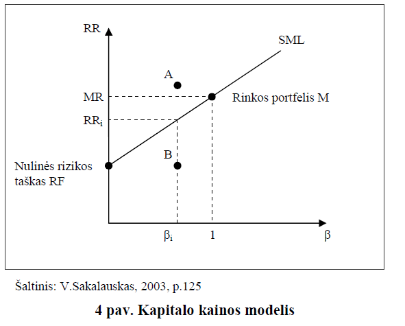

---
header-includes:
   - \usepackage[utf8]{inputenc}
   - \usepackage[english,lithuanian]{babel}
   - \usepackage[nottoc,numbib]{tocbibind}
   - \usepackage[titletoc]{appendix}
output: 
  pdf_document: 
    latex_engine: xelatex
    number_sections: yes
    toc_depth: 2
---

```{r, message=FALSE, echo=FALSE, include=F}
library("quantmod")
library("forecast")
library("xts")
library("dplyr")
library("gridExtra")
library("ggplot2")
library("reshape2")
library("knitr")
library("tseries")
library("sandwich")
library("lmtest")

```

\begin{titlepage}

\centerline{\bf \large Vilniaus Universitetas}
\bigskip
\centerline{\large \textbf{Matematikos ir informatikos fakultetas}}

\vskip 120pt
\centerline{\bf \Large \textbf{Kursinis darbas}}
\vskip 50pt
\begin{center}
    {\bf \LARGE Lietuvos akcijų rinkos grąžos priklausomybė nuo makroekonominių duomenų}
\end{center}
\bigskip
\centerline{\Large \textbf{Darbą atliko: Manvydas Sokolovas ir Paulius Kostickis}}
\bigskip
\centerline{\Large \textbf{Kursinio vadovas: lekt. dr. Dmitrij Celov}}
\vskip 90pt
\vskip 120pt
\centerline{\large \textbf{VILNIUS 2016}}
%\newpage
\end{titlepage}

\textwidth 6.5in
\textheight 9.00in

\section*{Santrauka}

&nbsp;&nbsp;&nbsp;&nbsp;&nbsp; Makroekonomiai rodikliai gali padėti nuspėti ateities verslo ciklą, kuris turi įtakos akcijų pelningumui. Naudojant Lietuvos makroekonominius duomenis, matuojamos  rizikos premijos, kurios gaunamos už riziką investuojant Lietuvos rinkoje. Šie duomenys iliustruoja Lietuvos ekonominę būklę.  Sudarytas „OMX Vilnius“ indekso grąžos įkainojimo ir prognozavimo modelis remiantis arbitražo įkainojimo teoremą (angl. APT), siekiant išsiaiškinti, kokie Lietuvos makroekonominiai rodikliai veikia „OMX Vilnius“ indekso grąžas. Sukurta prekybos strategija naudojant sukurtais prognozavimo ir įkainojimo modeliais ir palyginta su atsitiktiniu investavimu. Tirti mėnesiniai duomenys nuo 2002 iki 2016 metų. Dalis makroekonominių rodiklių yra reikšmingi vertinant indekso kainos pokyčius.

\newpage

\section*{Darbe naudojami trumpiniai}

APT – arbitražo įkainojimo teorija (Arbitrage Pricing Theory)
\newline CAPM – kapitalo įkainojimo modelis (Capital Asset Pricing Model)
\newline kk – kasyba ir karjerų eksploatacija
\newline mp – mažmeninė prekyba
\newline vp – verslo plėtros aktyvumas per 3 mėnesius
\newline ta – turimos akcijos
\newline ul – užsakymų lūkesčiai
\newline dll – darbo lygio lūkesčiai
\newline mhope – mažmeninės prekybos pasitikėjimas
\newline shope – statybų pasitikėjimas
\newline phope – paslaugų pasitikėjimas
\newline vhope – vartotojų pasitikėjimas
\newline pramhope – pramonės pasitikėjimas 
\newline gkl – gamintojų kainų lygis
\newline ip – industrinė produkcija

\newpage

\tableofcontents
\newpage

# Įvadas
&nbsp;&nbsp;&nbsp;&nbsp;&nbsp; Akcijų pokyčiams yra reikšminga ekonomikos būsena. Jei ekonomika auga, tuomet dauguma įmonių padidina savo pelną ir gamybą. Priešingas procesas, kai ekonomika traukiasi. Egzistuoja makroekonominiai rodikliai tokie kaip infliacija, valiutos kursas, palūkanų dydis, kurie padeda įvertinti ekonominę būklę, kuri yra svarbi pelningumui iš aktyvų. Todėl galima būtų manyti, jog makroekonominiai rodikliai koreliuoti su aktyvų grąžomis. Tačiau markoekonominių rodiklių poveikis akcijų rinkoms yra nevienareikšmis. Pavyzdžiui, yra atliktas tyrimas Rusijos rinkoje\cite{rusija}, remiantis arbitražo įkainojimo teorija, kurio tyrimo autorius nesugebėjo rasti reikšmingos makroekonominių duomenų  įtakos akcijų grąžoms. O Šri Lankos\cite{sri_lanka} ir Indijos\cite{indija} rinkoms atlikti empiriniai tyrimai parodė, jog makroekonominiai rodikliai turi įtakos akcijų grąžai. Todėl nutarta ištirti Lietuvos akcijų rinkos grąžos priklausomybę nuo makro rodiklių remiantis arbitražo įkainojimo teorija (angl. APT)  ir iš daugelių rodiklių atrinkti svarbiausius. 

&nbsp;&nbsp;&nbsp;&nbsp;&nbsp; Kylančiose rinkose daug dažniau pasitaiko neteisingai įkainotų finansinių instrumentų nei išvystytose (efektyviose) rinkose. Lietuvos rinką galime priskirti besivystančiosios rinkos kategorijai ir galbūt tyrimo išvadas, naudojant APT, galima bus praktiškai pritaikyti pelningiau investuojant. 

&nbsp;&nbsp;&nbsp;&nbsp;&nbsp;Pirmoje dalyje bus pateikta rizikos ir diversifikavimo svarba ir šio tyrimo matuojamas objektas - rizikos premijos. Vėliau aptariamas aktyvų įkainojimo modelis (CAPM) ir arbitražinė aktyvų įkainojimo teorija (APT) bei jų pritaikymas tyrime. Kitoje dalyje parodoma koreliacija tarp rodiklių, sudaromas prognozavimo ir įkainojimo modeliai bei rodiklių reikšmingumo tikrinimas. Turint modelius, bandoma juos panaudoti kuriant pelningesnę nei atsitiktinio investavimo strategiją ir jos patikrinimas remiantis praeities duomenimis.

# Aktyvų įkainojimas

## Rizika ir diversifikavimas

&nbsp;&nbsp;&nbsp;&nbsp;&nbsp; Investuojant į akcijas, kuo didesnis standartinis nuokrypis, tuo didesnė galimybė prarasti investuotus pinigus. Investicijų kontekste rizika bus matuojama standartiniu nuokrypiu. Taigi rizika ir pajamos iš investicijų yra tiesiogiai tarpusavyje susijusios: kuo didesnė rizika, tuo turėtų būti didesnės laukiamas pelnas iš investicijų, kad jos kompensuotų aukštą rizikos lygį. Svarbus tampa reikalaujamas pelningumas – tai mažiausias laukiamas pelnas, kurio yra reikalaujama už investavimą į rizikingą aktyvą. Investuotojas gali rinktis nerizikingą pelną, pirkdamas nerizikingus vertybinius popierius. Ši nerizikinga pelno norma yra minimumas, kurio gali tikėtis investuotojas neprisiimdamas jokios rizikos. Pirkdamas rizikingesnį vertybinį popierių, investuotojas reikalaus rizikos premijos (atpildo už rizikingų vertybinių popierių laikymą. Taigi nerizikinga pelno norma bei rizikos premija sudaro reikalaujamą pelningumą. Ši priklausomybė pavaizduota paveiksle apačioje (figure 1).


H. Markowitz sukurta portfelio teorija leidžia investuotojams įvertinti riziką ir laukiamas pajamas. Galimą riziką sumažinti, o pelną padidinti, jei bus investuojama į skirtingas įmones, kurių akcijų kainos juda skirtingomis kryptimis. Diversifikacija eliminuoja nesisteminę riziką dėl dviejų priežasčių: atskiros įmonės akcijos sudaro nedidelę dalį portfelyje, todėl poveikis (tiek teigiamas, tiek neigiamas) mažai juntamas. Darbe remiamasi prielaida, jog galime diversifikuoti nesisteminę riziką, todėl bus tiriama tik sisteminės rizikos teikiamas premijas. 


##Aktyvų įkainojimo modelis (CAPM)

&nbsp;&nbsp;&nbsp;&nbsp;&nbsp; Remiantis H. Markowitz sukurta portfelio teorija, buvo sukurtas teorinis aktyvų įkainojimo modelis (angl. CAPM). Vienas iš šio modelio kūrėjų William Sharpe Nobelio premiją 1990 m. Šis modelis yra svarbus tuo, jog yra pirmasis modelis, kuris turi aiškų pagrindimą, galima empiriškai testuoti ryšį tarp laukiamo pelno ir rizikos konkurencinėje rinkoje. Nors šio modelio prielaidos yra labai griežtos, dažnai neatitinkančios realaus gyvenimo. Nepaisant to, vis tiek bandoma testuoti modelį su realiais duomenimis ir galima įvertinti apytikslę sisteminės rizikos premiją remiantis praeities duomenimis. CAPM nedviprasmiškai tvirtina, kad vertybinio popieriaus kovariacija su rinkos portfeliu – vienintelis
tikras investicinės rizikos šaltinis gerai diversifikuotam portfeliui.
Jos formulė:

$$E(Y) - rf = \beta \times X$$

čia E(*Y*) - vidutinė akcijos grąža,
*rf* - nerizikingo aktyvo grąža,
$\beta$ - aktyvo rizikingumo jautrumas, 
*X* - visos rinkos grąža.

Pagal CAPM, akcijos tikėtinos grąžos premija priklauso nuo rinkos rezultatų ir specifinės sisteminės rizikos nuo rinkos jautrumo dydžio.

Prielaidos yra tokios:

Visi investuotojai vengia rizikos, kuri lygi portfelio pajamų (pelno) normos vidutiniam kvadratiniam nuokrypiui.

Visi investuotojai turi vienodą laiko horizontą (pvz., vienas mėnuo, dveji metai) investiciniam sprendimui priimti.

Visi investuotojai turi vienodą subjektyvų įvertį apie būsimą kiekvieną vertybinio popieriaus pelną ir riziką.

Rinkoje egzistuoja nerizikingoji investicija į turtą, ir kiekvienas investuotojas gali skolintis arba skolinti neribotą jo kiekį su nerizikingąja palūkanų norma.

Į visus vertybinius popierius kapitalą galima investuoti norimu santykiu, nėra išlaidų už sandorius, mokesčių bei apribojimų nepadengtajam pardavimui.

Laisvai prieinama ir vienodai galima informacija apie investicijas visiems investuotojams.

Kapitalo rinkos yra pusiausvyroje

Teorijos naudojimas ir jos interpretacija aptariama pasitelkiant šį brėžinį:



Taške RF rizikos laipsnis lygus 0. Jei vertybinis popierius yra virš vertybinių popierių rinkos tiesės SML (taškas A), tai reiškia, kad jis neįvertintas. Ir atvirkščiai, jei vertybinis popierius yra žemiau SML, tai reiškia, kad jis pervertinamas (taškas B). Nors pagal teorija tokia situacija neturėtų kilti (kad A taškas yra aukščiau SML tiesės), virš SML esančius aktyvus galėtume pirkti ilguoju laikotarpiu, nes jie yra pervertinti. Šiuo principu remsimės ir šiame darbe: bandysime įkainoti kito mėnesio aktyvą ir jei prognozuojama grąža yra didelė, bus perkamos OMX Vilnius indekso pozicijos ir bus tikimasi uždirbti daugiau nei vidutinė mėnesinė grąža. Tačiau modelis sudaroma bus pagal Arbitražinė aktyvų įkainojimo teoriją, kuri bus aptarta vėliau. Jos interpretacijos negalima paaiškinti Dekarto koordinačių sistema, nes egzistuoja daugiau rizikos faktorių.

CAPM atveju beta(rizikos veiksnys) yra pasirenkamas tos pačios rinkos indeksas, nes rinkos indeksas reprezentuoja visos rinkos portfelį, kurį turėtų būti optimalu pirkti. Kaip minėta anksčiau, prielaidos nėra realistiškos, tačiau ši teorija svarbi interpretuojant riziką, akcijų pelningumą.


##Arbitražinė aktyvų įkainojimo teorija (APT)
&nbsp;&nbsp;&nbsp;&nbsp;&nbsp; Kadangi yra tiriamas rizikingumas investuojant Lietuvos rinkoje naudojant makro duomenis, rizikos faktorių bus ne vienas kaip CAPM atveju, o daugiau. Tačiau CAPM yra svarbus tuo, kad jo pagrindu buvo kuriami ir tobulinami kiti aktyvų įkainojimo modeliai, kurie galėjo turėti mažiau apribojimų ir prielaidų, taip pat turėti ir daugiau įtakojančių rodiklių. Vienas iš patobulintų CAPM yra arbitražinė aktyvų įkainojimo teorija(angl. APT).  1966 m. atsirado pirmosios arbitražo įkainojimo teorijos idėjos, kai B. F. King (1966) pradėjo finansinių aktyvų grąžos pokyčius aiškinti ekonominiais duomenimis. Tačiau APT teorijos kūrėju yra laikomas S. A. Ross (1976), kuris pateikė  teorijai reikiamas prielaidas ir matematiškai pagrindė koncepciją. Šios teorijos pagrindas yra panašus, kaip ir CAPM, t. y. investuotojai reikalauja rizikos premijos už nediversifikuotos (sisteminės) rizikos prisisėmimą. Tačiau norint praktiškai pritaikyti APT, reikia: apibrėžti faktorius, įvertinti tų faktorių įtaką portfeliui, įvertinti faktoriaus premiją. APT neatsako į klausimus apie faktorių gausumą ir svarbumą, į kuriuos turi būti atsižvelgta vertinant laukiamas pajamas. Dažniausiai išskiriama nuo 3 iki 5 tokių
veiksnių. Jos formulė:

$E(Y) - rf = {\beta}_0 + {X}_1 {\beta}_1 + {X}_2 {\beta}_2$


&nbsp;&nbsp;&nbsp;&nbsp;&nbsp; Šis aktyvų įkainojimo modelis yra grindžiamas tuo, jog aktyvo premijinį pelningumą galima numatyti naudojant analizuojamo aktyvo ir daugelio įprastų rizikos faktorių tarpusavio ryšį. Nenurodoma kokie būtent faktoriai yra svarbūs rizikos premijai, tačiau sukurta S. Ross (1976) arbitražo įkainojimo teorija numato ryšį tarp portfelio pelningumo pasitelkiant daugelio nepriklausomų kintamųjų (makroekonominių faktorių, tokių kaip infliacija, ekonomikos augimas, tarptautinės gamybos apimtis, palūkanų normos ir t.t.) tiesinę kombinaciją. Darbe bus tiriamas įvairių makroekonominių rodiklių reikšmingumas grąžom ir gebėjimas prognozuoti grąžas remiantis praeities duomenimis. Taigi pasitelkiant šią įkainojimo teoriją, bus siekiama pasipelnyti iš gerai įvertintos kito mėnesio OMX Vilniaus indekso grąžos. Neteisingai įkainoto aktyvo kaina skirsis nuo tos, kuri nustatoma šio modelio dėka. Tokiu būdu investuotojai, norintys pasinaudoti arbitražu ir gauti faktiškai nerizikingą pelną, sieks palaikyti trumpas pervertinto aktyvo pozicijas ir kartu laikyti ilgas portfelio (kurio pagrindu yra atliekami APT skaičiavimai) pozicijas.

Taip pat APT prielaidos yra paprastesnės už CAPM, tačiau vis tiek yra ginčytinos ir negalime teigti, jog realistiškos. 

APT taikymo prielaidos:
1) finansų rinkos apibūdinamos kaip tobulos ir
efektyvios;
2) apibrėžtumo atveju investuotojai visada teiks
pirmenybę didesnio pelningumo portfeliui;
3) egzistuoja tam tikros svarbios sisteminės rizikos,
kurios tiesiškai veikia aktyvų pelningumą,
t. y. aktyvų pelningumus generuojantį stochastinį
procesą galima išreikšti kaip n rizikos
faktorių ar indeksų tiesinę kombinaciją; be to,
investuotojai tas rizikas suvokia ir gali įvertinti
aktyvo jautrumą toms rizikoms;
4) ekonomikoje yra agresyvių investuotojų, kurie išnaudos aktyvų numatomų
pelningumų skirtumus pasinaudodami
arbitražu.

Iliustracija (figure 2):


paveiksle Juoda  tiese B yra S&P 500  indekso vertybinių popierių rinkos tiesė (SML), taškas A yra portfelis, kuris yra aukščiau tiesės. Kai rinka pasiekusi pusiausvyrą, remiantis CAPM tokia situacija neįmanoma, nes galimas tik vienas visiems prieinamas optimalus portfelis. Tačiau pavaizduota situacija yra praktiškai galima. Pagal APT tokia situacija galima, kai yra daugiau rizikos veiksnių nei įskaičiuota modelyje.

Taigi investuotojai pasitelkia šią įkainojimo teoriją, siekdami pasipelnyti iš neteisingai įvertintų (dažniausiai nepakankamai įvertintų) aktyvų. Tačiau neteisingai įkainoto aktyvo kaina skirsis nuo tos, kuri nustatoma šio modelio dėka. Tokiu būdu investuotojai, norintys pasinaudoti arbitražu ir gauti faktiškai nerizikingą pelną, sieks palaikyti trumpas pervertinto aktyvo pozicijas ir kartu laikyti ilgas portfelio (kurio pagrindu yra atliekami APT skaičiavimai) pozicijas.


Jei APT prielaidos patenkinamos, tuomet laukiami pelningumai bus išsidėstę arti SML, o aktyvas turės tiek rizikos charakteristikų, kiek yra veiksnių. APT teorijos prielaidos yra artimesnės realybei negu CAPM, nes ne visi investuotojai elgiasi vienodai rinkoje, net jei jų elgsena grindžiama racionalumu, t. y. APT nereikalauja CAPM prielaidų tenkinimo dėl investuotojų naudingumo funkcijų. Be to, ne kiekvienas investuotojas yra linkęs turėti rinkos portfelį kaip vienintelę alternatyvą, t. y. APT nereikalauja CAPM prielaidos tenkinimo dėl rinkos portfelio savybių (kad jis apima visus rizikingus aktyvus ir yra efektyvus vidurkio-dispersijos prasme).
Naudodami Lietuvos makro duomenis, matuojama  rizikos premijos, kurios gaunamos už riziką investuojant Lietuvos rinkoje. Makroduomenys iliustruoja Lietuvos ekonominę būklę. 

\newpage

# Duomenų transformacijos
Duomenys naudojami nuo 2002 metų iki 2016 metų, ankstesnių duomenų nepavyko išgauti.

OMX Vilnius indeksas transformuojamas į mėnesinius procentinius pokyčius: $r(t) = (log(X(t)) – log(X(t-1)) ) \times 100$, 
čia *X(t)* - OMX indekso mėnesinė kaina nuo laiko (mėnesio) t, *r(t)* yra indekso mėnesinis pokytis procentais.
Tokiu pačiu būdu gaunama kitų akcijų indeksų grąža logaritmuojant ir imant pokyčius  S&P350 Europe indeksų kainas, kasybos ir karjerų eksploatacijos, mažmeninės prekybos, industrinės produkcijos indeksus. Visi logaritmuoti duomenys padauginami iš šimto, kad pokytis būtų interpretuojamas procentais. Euribor buvo pateiktas metinėmis palūkanomis, transformuojami į mėnesines palūkanas. Dolerio/euro valiutų kursas, pasitikėjimo ir lūkesčių rodikliai yra imami mėnesiniai pokyčiai.

Tikrinami duomenys po transformacijų ar turi vienetinę šaknį (stacionarumo tikrinimas), atliekamas Dickey-Fuller testas:
```{r, message=FALSE, echo=FALSE}
data=read.csv("rawdata.csv")


data[ data == ":" ] = NA
data=data[complete.cases(data),]
rownames(data)<-NULL
```

```{r, message=FALSE, echo=FALSE,warning =FALSE}
data2=apply(data[,-1],2,as.numeric)
rownames(data2)=data[,1]
data2=data.frame(data2)
data2$nedarbas=data2$nedarbas/10

data2[,c("OMX","SP350","SP500","kk","mp","ip")] = apply(data2[,c("OMX","SP350","SP500","kk","mp","ip")],2,log)    #logaritmuojama indeksai, akcijų kainos, kursas  

data2[,c("OMX","SP350","SP500","kk","mp","ip")]=data2[,c("OMX","SP350","SP500","kk","mp","ip")]*100

data2$euribor=((data2$euribor+1)^(1/12)-1)*12                    #reiketu gal menesio?
names(data2)[names(data2) == 'euribor'] <- 'palukanos'

data3=data.frame(diff(as.matrix(data2)))  
data3$euribor=data2$euribor[-1]
names(data3)[names(data3) == 'euribor'] <- 'palukanos'
data3$gkl = data$gkl[-1]    #gamintoju kainu lygio nereik diferencijuot nes jau yra pokytis %
#tsdisplay(data3$infliacija)

p=apply(data3[,],2,function(i)adf.test(i,k=1)$p.value)
p=data.frame(p)
p[,1] = round(p[,1], digits = 2)
kable(p)

data3$OMX=data3$OMX-data3$palukanos
data3$SP350=data3$SP350-data3$palukanos
data3$SP500=data3$SP500-data3$palukanos
```

* Visų kintamųjų, išskyrus infliaciją, p - value mažiau už 0.05, galime atmesti H0, kad turi vienetinę šaknį, visi kintamieji, išskyrus infliaciją, yra stacionarūs.
\newpage
```{r, message=FALSE, echo=FALSE}
Data = rownames(data3)
Data=as.yearmon(Data, "%YM%m")

data3=cbind.data.frame(Data, data3)
```

\newpage

# Modeliavimas

Modelis:
```{r, message=FALSE, echo=FALSE}
modelis=lm(OMX ~ SP350  + lag(phope,12)  + lag(ul,10)+lag(mhope, 3)+ lag(gkl, 9)+  lag(ip, 11)+lag(kursas,2),data=data3)  
datafr=data.frame(summary(modelis)[c(4,8)] %>%  lapply(round,2))
colnames(datafr)=c("koeficientai","standartinis nuokrypis","koeficientu t reikšmes","p reiksme", "R kvadratas")

datafr[2:nrow(datafr),"R kvadratas"]="-"
kable(datafr)
```

Heteroskedastiškumo korekcija:

```{r, message=FALSE, echo=FALSE}

kable(coeftest(modelis, vcov=vcovHC)[,])
summary(modelis)[8]


```

&nbsp;&nbsp;&nbsp;&nbsp;&nbsp; Kintamiesiems atrinkti ankstiniai(lag'ai) pagal didžiausią kryžminę koreliaciją su OMX Vilnius indekso grąžomis. Sudarytas modelis iš daugybės kintamųjų ir atliktas stepAIC.  Didelė dalis makroekonominių duomenų buvo nereikšmingi, tačiau aptikome ir keletą reikšmingų kintamųjų. Modelis paaiškina apie 34 procentų OMX Vilnius indekso grąžos pokyčių.

\newpage


```{r, message=FALSE, echo=FALSE}
 par(mfrow = c(2, 2))
plot(modelis)
```


```{r, message=FALSE, echo=FALSE}
res<-bptest(modelis)
# p-value < 0.05, tai H0 negalime priimti - duomenys homoskedastiški.

```

Tikrinama autokoreliacija:

```{r, message=FALSE, echo=FALSE}

Box.test(modelis$res, fitdf=0, type="Lj")
#p-value >0.05, vadinasi H0 neatmetama. Galima teigti, kad liekanos yra baltasis triukšmas.
```

Tikrinamas normalumas paklaidų:

```{r, message=FALSE, echo=FALSE}
shapiro.test(modelis$residuals)
# p-value > 0.05 - liekanos yra normalios
```

\newpage
#Modeliai ir investavimo strategijos

Tarkime *t* žymi mėnesį nuo pirmo matavimo mėnesio iki 169-to mėnesio, *t* yra sveikas skaičius nuo 1 iki 169. 
Vertinant kito mėnesio OMX Vilniaus grąžas, t.y. laiko momentui *t+1*, modelyje kintamųjų duomenys gali būti vėliausias *t* laiko momento, nes turi būti žinomi rodiklių duomenys *t* laiko momentu.
Duomenų pavėlinimus renkantis pagal kryžminę koreliaciją ir atrinkus reikšmingus kintamuosius pagal step AIC, gaunamas toks modelis:

1) (r(*t+1*)=)OMX(*t+1*)(hat) =beta1 SP350  + beta2 phope(*t-11*)  + beta3 ul(*t-9*) + beta4 mhope(*t-2*)+beta5 gkl(*t-8*)+ beta6 ip(*t-7*)+beta7 kursas(*t-1*)

Šio mėnesio grąžos įvertinimas yra panašus kaip ir modelio nr. 1), tačiau šiuo atveju naudojamas nepavėlintas :
2) (R(*t*)=) OMX(*t*)(hat) =beta1 SP350  + beta2 phope(*t-12*)  + beta3 ul(*t-10*) + beta4 mhope(*t-3*)+beta5 gkl(*t-9*)+ beta6 ip(*t-8*)+beta7 kursas(*t-2*)

Šių modelių prognozių grafikas remiantis modeliu ir tuo metu turima imtimi (prognozuojama *t+1*-ojo mėnesio grąža iš *t* mėnesių). Linijos eina ties -2 ir +2 % grąža.

Prognozuojama ir reali akcijų grąža:
```{r, message=FALSE, echo=FALSE}
progn=numeric()
 for(i in 12:168){
   modelis = lm(OMX ~ lag(SP350,1)  + lag(phope,12)  + lag(ul,10)+lag(mhope, 3)+ lag(gkl, 9)+  lag(ip, 11)+lag(kursas,2),data=data3)  
   a=predict(modelis, data3[1:i+1,])
   progn=append(progn,a[length(a)])
   
}

progn=as.numeric(progn)
a=cbind(progn,data3$OMX[13:length(data3$OMX)])
a=data.frame(a)

menesiai=c(1:158)
a=cbind(menesiai,a)
rownames(a)=NULL
colnames(a)=c("menesiai","progn", "reali")
akc = melt(a, id=c("menesiai"))
ggplot(akc) + geom_line(aes(x=menesiai, y=value, colour=variable)) +
  scale_colour_manual(values=c(1:2))+ylab("% pokytis")+
  guides(col=guide_legend(title="Kintamieji")) +
  geom_hline(yintercept = 2)+
  geom_hline(yintercept = -2)
```

Kadangi yra modeliai, remiantis jais bus bandoma investuoti. Čia aprašoma galimos investavimo strategijos, į mokesčius bus neatsižvelgiama. 
Pirma strategija: tarkime dabar *t* mėnesis ir turimi mėnesio *t* ir ankstesnių mėnesių duomenys, prognozuojama *t+1* mėnesio grąža pagal modelį(įvertinį) nr. 1), gaunamas įvertis r(*t+1*). Modelio koeficientai (betos) prie kintamųjų įvertinamos mažiausių kvadratų metodu iš turimu duomenų laiko momentu *t*. Jei r(*t+1*)>2 (matuojama %), tai tada bus perkama OMX Vilnius indeksas *t* laiko momentu ir parduodama *t+1* laiko momentu, tikroji grąža bus lygi OMX(*t+1*). Bandoma atlikti tik pelningesnius pirkimus prognozuojant *t+1* grąžą, todėl įvertis ne tik teigiamas turi būti, bet ir didesnis už pasirinktą skaičių, šiuo atveju už 2%.

Antra strategija: tarkime dabar yra *t* mėnesis ir turimi *t* mėnesio ir ankstesnių mėnesių duomenys, prognozuojama *t+1* mėnesio grąža pagal modelį nr. 1), gaunamas įvertis r(*t+1*). Modelių koeficientai(betos) gaunamos mažiausių kvadratų metodu iš turimų duomenų *t* laiko momentu. Tada skaičiuojamas *t* mėnesio (dabartinio mėnesio) įvertis pagal modelį (įvertinį) nr. 2), įvertį žymėkime R(*t*). Tikrąsias grąžų reikšmes *t* laiko momentu žymimos bus OMX(*t*). Jei R(*t*) >= OMX(*t*) ir r(*t+1*) > 1 arba R(*t*) < OMX(*t*) ir r(*t+1*) > 4  tada bus perkama OMX Vilnius indeksas *t* laiko momentu ir parduodama *t+1* laiko momentu, tikroji grąža bus lygi OMX(*t+1*) (matuojama %). Šios strategijos prasmė: kai manome, jog per maža šio mėnesio grąža, galime manyti, jog galbūt buvo blogai įkainotas indeksas, tuomet mes mažesnio reikalausime prognozuojamos grąžos kitam mėnesiui, nes tikėsimes, kad OMX Vilnius yra šiek tiek nuvertintas. O jeigu šio mėnesio grąža didesnė negu modelio įvertinta grąža, pirkimas būtų atsargesnis, t.y. bus reikalaujama didesnės prognozuojamos grąžos, kad įvykdyti pirkimą.


Pirmos strategijos pelningumas, kai nuo k-tojo imties mėnesio prognozuojamas *k+1* mėnesio grąža ir naudojama strategija. Čia *k* sveikasis skaičius mažesnis už 169(visų turimų duomenų skaičius). Tada imama *k+1* imtis ir prognozuojama *k+2* mėnesio grąža ir naudojama pirkimo strategija ir t.t. kol pasiekiamas 169 mėnesis. Jeigu *k*-tojo mėnesio indeksas perkamas, tuomet OMX(*k*) sumuojama. Skaitoma, kad perkama su vienodu pinigu kiekiu kiekviename pirkime, taigi grąžų suma bus turto prieaugis procentais. Rezultatas:

```{r, message=FALSE, echo=FALSE}
formula_prog=OMX ~ lag(SP350,1)  + lag(phope,12)  + lag(ul,10)+lag(mhope, 3)+ lag(gkl, 9)+  lag(ip,11)+lag(kursas,2)
formula_kain=OMX ~ SP350  + lag(phope,12)  + lag(ul,10)+lag(mhope, 3)+ lag(gkl, 9)+  lag(ip,11)+lag(kursas,2)

#kodas parasytas tikrinimui su atsitiktiniu pirkimu, sioje dalyje panaikinsime atsitiktinius pirkimus ir parodysime tik strategiju pirkimus ir pelnus 

gen=function(pradzia,pirkti){
b=sample(pradzia:169,length(pirkti),replace=F)
return(sum(data3[b,"OMX"]))
}


validation=function(pradzia,formula_prog){
  pirkti=numeric()
    for(i in pradzia:168){
      modprog <- lm( formula_prog, data = data3[1:i,])
      a=predict(modprog, data3[1:i+1,])
      a=a[length(a)]
      if(matrix(a)[1]>2){pirkti=append(pirkti,i+1)}
    }
  graza=sum(data3[pirkti,"OMX"])
  random=replicate(10000,gen(pradzia,pirkti))
  p=mean(random<graza)
  vidurkis_random = mean(random)
  if(p==0){p="nebuvo pirkimu"}
  else{
    p=append(p,graza)
    p=append(p,vidurkis_random)
    p=append(p,length(pirkti))
    p=append(p,pradzia)
    p=round(p,3)
    }
  return(p)                               
}

validation2=function(pradzia,formula_prog,formula_kain){
  pirkti=numeric()
  for(i in pradzia:168){
    modprog <- lm(formula_prog, data = data3[1:i,])
    a=predict(modprog, data3[1:i+1,])
    a=a[length(a)]
    modkain=lm(formula_kain,data=data3[1:i,])
    b=predict(modkain, data3[1:i,])
    b=b[length(b)]
    b= b-data3[i,"OMX"]
    if(matrix(a)[1]>1 & matrix(b)[1]>=0){pirkti=append(pirkti,i+1)}
    if(matrix(a)[1]>4 & matrix(b)[1]<0){pirkti=append(pirkti,i+1)}
  }
  graza=sum(data3[pirkti,"OMX"])
  random=replicate(10000,gen(pradzia,pirkti))
  p=mean(random<graza)
  vidurkis_random = mean(random)
  if(p==0){p="nebuvo pirkimu"}
  else{
    p=append(p,graza)
    p=append(p,vidurkis_random)
    p=append(p,length(pirkti))
    p=append(p,pradzia)
    p=round(p,3)
  }
  return(p)                               
}

lentele=data.frame()
for(i in c(30,70,100,130,140,150)){
  lentele=rbind(lentele,validation(i,formula_prog))
}

lentele[,c(1:5)]=lentele[,c(5,2,3,1,4)]
colnames(lentele)=c("pradinis imties dydis","strategijos premijinė grąža","vidutine atsitiktinio pirkimo premijine graza","tikimybe, kad geriau uz atsitiktini pirkima","pirkimu skaicius")
lentele=lentele[,-c(3,4)]
kable(lentele)
```

Pradinis imties dydis anksčiau buvo vadintas *k*-tuoju mėnesiu strategijos pritaikymo apraše.

Sąlygos tokios pačios kaip ir pirmajai strategijai, antros strategijos pelningumo rezultatai:

```{r, message=FALSE, echo=FALSE}
lentele2=data.frame()
for(i in c(30,70,100,130,140,150)){
  lentele2=rbind(lentele2,validation2(i,formula_prog,formula_kain))
}

lentele2[,c(1:5)]=lentele2[,c(5,2,3,1,4)]
colnames(lentele2)=c("pradinis imties dydis","strategijos graza","vidutine atsitiktinio pirkimo graza","tikimybe, kad geriau uz random","pirkimu skaicius")
lentele2=lentele2[,-c(3,4)]
kable(lentele2)

```

Matome, jog pelnas didesnis su antrąja strategija, taip pat ir daugiau pirkimų buvo atlikta.


Dabar testuojama ar su strategija yra pelningiau pirkti nei atsitiktinai. Bus generuojami pirkimai monte carlo metodu ir atsitiktiniams pirkimams bus taikomos tokios pat sąlygos: pirkimų skaičius toks pat kaip ir strategijos, atsitiktinai gali būti atliktas pirkimas, jei buvo galimybė pirkti tuo laikotarpiu su strategija.
Rezultatas:

```{r, message=FALSE, echo=FALSE}
lentele2=data.frame()
for(i in c(30,70,100,130,140,150)){
  lentele2=rbind(lentele2,validation2(i,formula_prog,formula_kain))
}

lentele2[,c(1:5)]=lentele2[,c(5,2,3,1,4)]
colnames(lentele2)=c("prad. imt. dyd.","strateg. graza","vid. random graza","tikimybe, kad geriau uz random","pirk. sk.")
kable(lentele2)

```

Strategija geriau pasirodė nei atsitiktinis investavimas.

\newpage

\begin{thebibliography}{00}
\bibitem{rusija}
  Mauri Paavola, Tests of the Arbitage Pricing Theory using Macroeconomic Variables in the Russian Equity Market.

\bibitem{brooks}
  Chris Brooks, Introductory Econometrics for Finance.
 
 \bibitem{sri_lanka}
   Prabath Suranga Morawakage, Relationship between Macro – Economic Variables and Stock Market Performance of Colombo Stock Exchange.
 
 \bibitem{indija}
   Sagarika Mishra, Do Macro - Economic Variables explain Stock - Market Returns? Evidence using a Semi-Parametric Approach.
 
 \bibitem{capm} 
   University of Pennsylvania, The Capital Asset Pricing Model: An Aplication of Bivariate Regression Analysis.

 \bibitem{apt_capm}
   Aistė Launagaitė, Vertybinių popierių rizikos ir pelningumo modelių įvertinimas.
 
\end{thebibliography}

\newpage

\setcounter{section}{0}
\renewcommand\thesection{\Alph{section}}

# Priedai:

## Kintamieji
Darbe naudojami mėnesiniai duomenys nuo 2002 metų birželio iki 2016 metų liepos. Duomenys gauti iš Eurostat ir Europos Centrinio Banko svetainių. Susiduriama su mėnesinių rodiklių trūkumu: BVP, gyventojų pajamos, pinigų paklausa yra ketvirtiniai duomenys. Taip pat žvelgiant pasauliniu mastu, Vilniaus akcijų birža yra smulki, o akcijų likvidumas čia taip pat žemas. Nepaisant šių problemų, buvo rasta koreliacija tarp kai kurių makroekonominių duomenų ir OMX Vilnius indekso grąžų.

* S&P 350 Europe - tai indeksas sudarytas iš 350 didžiausių Europos imonių akcijų.
* S&P 500 - tai indeksas sudarytas iš 500 didžiausių Amerikos imonių akcijų.
* Euribor 3 mėnesių - palūkanų norma už kurią Europos bankai skolina pinigus vieni kitiems trijų mėnesių laikotarpiui.
* Euro ir JAV dolerio valiutos kursas.
* Nedarbas - darbingų nedirbančių žmonių skaičius 1000 žmonių.
* Pramonės gamintojų kainos  - matuoja vidutinę kainų raidą, visų produktų bei paslaugų iš pramonės sektoriaus ir parduotų vidinėje rinkoje. Procentinis pokytis nuo praeito mėnesio.
* Infliacija - 12 mėnesių infliacija apskaičiuota pagal mažmeninės prekybos indeksą.
* Industrinė produkcija - indeksas matuoja produkcijos kiekį nuo gamybos, kasybos, elektros ir dujų pramonės. Atskaitiniai metai 2010 (2010m. indeksas = 100).
* Darbo lygio ir užsakymų lūkesčiai - mėnesinės apklausos, teigiamų ir neigiamų atsakymų santykis.
* Pasitikėjimo indikatoriai - pramonės, mažmeninės prekybos, vartotojų, paslaugų, statybų. Tai yra apklausų teigiamų ir neigiamų atsakymų santykis.
* Mažmeninė prekyba, išskyrus variklinių transporto priemonių ir motociklų prekybą- indeksuotas rodiklis (2010m indeksas = 100).

## Duomenų vizualizacija

```{r, message=FALSE, echo=FALSE}
panel.hist <- function(x, ...)    #ši funkcija reikalinga grafikų lentelei išbrėžti (histogramos pateikimui)                        
{
  usr <- par("usr"); on.exit(par(usr))
  par(usr = c(usr[1:2], 0, 1.5) )
  h <- hist(x, plot = FALSE)
  breaks <- h$breaks; nB <- length(breaks)
  y <- h$counts; y <- y/max(y)
  rect(breaks[-nB], 0, breaks[-1], y, col = "cyan", ...)
}

panel.cor2 <- function(x, y, digits=2, cex.cor)
{
  usr <- par("usr"); on.exit(par(usr))
  par(usr = c(0, 1, 0, 1))
  r <- abs(cor(x, y))
  txt <- format(c(r, 0.123456789), digits=digits)[1]
  test <- cor.test(x,y)
  Signif <- ifelse(round(test$p.value,3)<0.001,"p<0.001",paste("p=",round(test$p.value,3)))  
  text(0.5, 0.25, paste("r=",txt))
  text(.5, .75, Signif)
}
panel.cor <- function(x, y, digits = 2, prefix = "", cex.cor,...)    #ši funkcija reikalinga grafikų lentelei
    #išbrėžti (koreliacijos koeficiento radimui)
{
  usr <- par("usr"); on.exit(par(usr))
  par(usr = c(0, 1, 0, 1))
  r <- abs(cor(x, y))
  txt <- format(c(r, 0.123456789), digits = digits)[1]
  txt <- paste0(prefix, txt)
  if(missing(cex.cor)) cex.cor <- 0.8/strwidth(txt)
  text(0.5, 0.5, txt, cex = 3)
}
```

<br>
S&P350 Europe indeksas yra įtraukiamas, remiantis CAPM. Galima teigti, jog OMX Vilniaus indeksas yra stipriai susijęs su S&P350 indeksu ir šis indeksas gerai apibūdina sisteminę riziką kaip ir kitoms Europos rinkoje esančiomis akcijoms. 
Pagal CAPM turėtų matytis koreliacija tarp OMX Vilniaus indekso ir S&P 350 Europe. Koreliacija aiškiai matoma grafike. Tai patvirtina, jog reikėtų bandyti įtrauki Europos indeksą aiškinant grąžų premijos riziką.

Akcijų indeksų mėnesiniai procentiniai pokyčiai:

```{r, message=FALSE, echo=FALSE,warning=F}
akc = melt(data3[,c("OMX","SP350","SP500","Data")], id=c("Data"))
ggplot(akc) + geom_line(aes(x=Data, y=value, colour=variable)) +
  scale_colour_manual(values=c(1:4))+ylab("% pokytis")+
  guides(col=guide_legend(title="Kintamieji"))
```

\newpage

Kintamųjų koreliacija su OMX Vilnius. r - koreliacijos koeficientas, p - koreliacijos reikšmingumas:

```{r, message=FALSE, echo=FALSE}
pairs(data3[,c("OMX","SP350","nedarbas","kursas")],upper.panel=panel.smooth,diag.panel=panel.hist, lower.panel=panel.cor2)
```

```{r, message=FALSE, echo=FALSE}
pairs(data3[,c("OMX","mhope","phope","ul","gkl","ip")],upper.panel=panel.smooth,diag.panel=panel.hist, lower.panel=panel.cor2)
```

* Kaip ir buvo tikėtasi tarp kintamųjų ir OMX Vilnius rasta nestipri koreliacija, tačiau reikšminga. 


