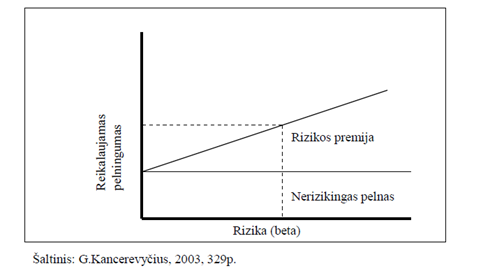

---
header-includes:
   - \usepackage[utf8]{inputenc}
   - \usepackage[english,lithuanian]{babel}
   - \usepackage[nottoc,numbib]{tocbibind}
   - \usepackage[titletoc]{appendix}
output: 
  pdf_document: 
    latex_engine: xelatex
    number_sections: yes
    toc_depth: 2
---
```{r, message=FALSE, echo=FALSE, include=F}
library("quantmod")
library("forecast")
library("xts")
library("dplyr")
library("gridExtra")
library("ggplot2")
library("reshape2")
library("knitr")
library("tseries")
library("sandwich")
library("lmtest")
library("MASS")
Sys.setlocale(locale="en_US.UTF-8")
library("extrafont")
loadfonts()
```

\begin{titlepage}

\centerline{\bf \large VILNIAUS UNIVERSITETAS}
\bigskip
\centerline{\large \textbf{MATEMATIKOS IR INFORMATIKOS FAKULTETAS}}

\vskip 120pt
\centerline{\bf \large \textbf{Kursinis darbas}}
\vskip 50pt
\begin{center}
    {\bf \LARGE Lietuvos akcijų rinkos grąžos priklausomybė nuo makroekonominių duomenų}
\end{center}
\vskip 30pt
\centerline{\large \textbf{Darbą atliko: Manvydas Sokolovas ir Paulius Kostickis}}
\bigskip
\centerline{\large \textbf{Kursinio vadovas: lekt. dr. Dmitrij Celov}}
\vskip 90pt
\vskip 160pt
\centerline{\large \textbf{VILNIUS 2016}}
%\newpage
\end{titlepage}

\textwidth 6.5in
\textheight 9.00in

\begin{titlepage}
\centerline {\bf \large MATEMATIKOS IR INFORMATIKOS FAKULTETAS}
\vskip 10pt
\centerline {\bf EKONOMETRINĖS ANALIZĖS KATEDRA}

\vskip 120pt
\large Darbo vadovas lekt. dr. Dmitrij Celov \underline{\hskip 95pt} 

\large Darbo vadovo įvertinimas  \underline{\hskip 94pt} 
\vskip 150pt


\large Darbas apgintas \underline{\hskip 94pt }

\large Darbas įvertintas \underline{\hskip 94pt }

\vskip 140pt

{\large Registravimo NR. \underline{\hskip 94pt }

Atidavimo į Katedrą data \underline{\hskip 94pt} }
\end{titlepage}
\textwidth 6.5in
\textheight 9.00in

\section*{Santrauka}

&nbsp;&nbsp;&nbsp;&nbsp;&nbsp; Makroekonomiai rodikliai gali padėti nuspėti ateities verslo ciklą, kuris turi įtakos akcijų pelningumui. Naudojant Lietuvos makroekonominius duomenis, matuojamos  rizikos premijos, kurios gaunamos už riziką investuojant Lietuvos rinkoje. Šie duomenys iliustruoja Lietuvos ekonominę būklę.  Sudarytas „OMX Vilnius“ indekso grąžos įkainojimo ir prognozavimo modelis remiantis arbitražo įkainojimo teoremą (angl. APT) siekiant išsiaiškinti, kokie Lietuvos makroekonominiai rodikliai veikia „OMX Vilnius“ indekso grąžas. Sukurta prekybos strategija naudojant sukurtą prognozavimo modelį ir strategija palyginta su atsitiktiniu investavimu. Tirti mėnesiniai duomenys nuo 2002 iki 2016 metų. Dalis makroekonominių rodiklių yra reikšmingi vertinant indekso kainos pokyčius. Jų reikšmingumas tirtas dvigubos atrankos metodu. Sukurta strategija ir prognozavimo modelis padeda geriau investuoti lyginant su atsitiktiniu investavimu.

\newpage
\tableofcontents
\newpage

# Įvadas
&nbsp;&nbsp;&nbsp;&nbsp;&nbsp; Akcijų pokyčiams yra reikšminga ekonomikos būsena. Ekonominis ciklas turi tendenciją kilti, tačiau jos plėtra vyksta tai sparčiau, tai lėčiau ir galimas nuosmukis. Jei ekonomika auga, tuomet dauguma įmonių padidina savo pelną ir gamybą. Priešingas procesas, kai ekonomika traukiasi. Egzistuoja makroekonominiai rodikliai tokie kaip infliacija, valiutos kursas, palūkanų dydis, kurie padeda įvertinti ekonominę būklę, kuri yra svarbi pelningumui iš aktyvų. Todėl galima būtų manyti, jog makroekonominiai rodikliai koreliuoja su aktyvų grąžomis. Tačiau markoekonominių rodiklių poveikis akcijų rinkoms yra nevienareikšmis. Pavyzdžiui, yra atliktas tyrimas Rusijos rinkoje\cite{rusija}, remiantis arbitražo įkainojimo teorija, kurio tyrimo autorius nesugebėjo rasti reikšmingos makroekonominių duomenų  įtakos akcijų grąžoms. O Šri Lankos\cite{sri_lanka} ir Indijos\cite{indija} rinkoms atlikti empiriniai tyrimai parodė, jog makroekonominiai rodikliai turi įtakos akcijų grąžai. Todėl nutarta ištirti Lietuvos akcijų rinkos grąžos priklausomybę nuo makro rodiklių remiantis arbitražo įkainojimo teorija (angl. APT) iš daugelių rodiklių atrinkti svarbiausius. 

&nbsp;&nbsp;&nbsp;&nbsp;&nbsp; Kylančiose rinkose daug dažniau pasitaiko neteisingai įkainotų finansinių instrumentų nei išvystytose (efektyviose) rinkose. Lietuvos rinką galime priskirti besivystančiosios rinkos kategorijai ir galbūt tyrimo išvadas, naudojant APT, galima bus praktiškai pritaikyti pelningiau investuojant. Todėl kurtas prognozuojantis modelis su investavimo(tiksliau spekuliavimo) strategija ir ji palyginta su atsitiktinu investavimu.

&nbsp;&nbsp;&nbsp;&nbsp;&nbsp;Pirmoje dalyje bus pateikta rizikos ir diversifikavimo svarba ir šio tyrimo matuojamas objektas - rizikos premijos. Vėliau aptariamas aktyvų įkainojimo modelis (CAPM) ir arbitražinė aktyvų įkainojimo teorija (APT) bei jų pritaikymas tyrime. Kadangi jų prielaidos mažai realistiškos, darbe bus sukurtos ir naudojamos kitos prielaidos, tačiau jos sukurtos remiantis diversifikavimo teorija, CAPM ir APT.  Kitoje dalyje sudaromas įkainojimo modelis ir tikrinamas rodiklių reikšmingumas naudojant dvigubos atrankos metodologiją. Vėliau kuriamas prognozuojantis modelis, kuriuo bus bandoma nuspėti kito mėnesio OMX Vilniaus indekso grąžą ir naudojantis sukurta strategija lyginama su atsitiktiniu investavimo rezultatais, atsitiktinį investavimą simuliuojant monte carlo metodu. 

# Aktyvų įkainojimas

## Rizika ir diversifikavimas

&nbsp;&nbsp;&nbsp;&nbsp;&nbsp; Investuojant į akcijas, kuo didesnis standartinis nuokrypis, tuo didesnė galimybė prarasti investuotus pinigus. Investicijų kontekste rizika bus matuojama variacija. Taigi rizika ir pajamos iš investicijų yra tiesiogiai tarpusavyje susijusios: kuo didesnė rizika, tuo turėtų būti didesnės laukiamas pelnas iš investicijų, kad jos kompensuotų aukštą rizikos lygį. Priimant investicinį sprendimą svarbus tampa reikalaujamas pelningumas – tai mažiausias laukiamas pelnas, kurio yra reikalaujama už investavimą į rizikingą aktyvą. Investuotojas gali rinktis nerizikingą pelną, pirkdamas nerizikingus vertybinius popierius. Ši nerizikinga pelno norma yra minimumas, kurio gali tikėtis investuotojas neprisiimdamas jokios rizikos. Pirkdamas rizikingesnį vertybinį popierių, investuotojas reikalaus rizikos premijos (atpildo už rizikingų vertybinių popierių laikymą). Taigi nerizikinga pelno norma bei rizikos premija sudaro reikalaujamą pelningumą. Ši priklausomybė pavaizduota paveiksle apačioje (1 pav.).



&nbsp;&nbsp;&nbsp;&nbsp;&nbsp; Investiciniams sprendimas priimti esant neapibrėžtumui H. Markowitz pasiūlė portfelio teorija, leidžiančia investuotojams įvertinti riziką ir laukiamas pajamas. Galimą riziką sumažinti, o pelną padidinti, jei bus investuojama į skirtingas įmones, kurių akcijų kainos juda skirtingomis kryptimis. Diversifikacija eliminuoja nesisteminę riziką dėl dviejų priežasčių: atskiros įmonės akcijos sudaro nedidelę dalį portfelyje, todėl poveikis (tiek teigiamas, tiek neigiamas) mažai juntamas. Darbe remiamasi prielaida, jog galime diversifikuoti nesisteminę riziką, todėl bus tiriama tik sisteminės rizikos teikiamas premijas. 


##Aktyvų įkainojimo modelis (CAPM)

&nbsp;&nbsp;&nbsp;&nbsp;&nbsp; Remiantis H. Markowitz sukurta portfelio teorija, buvo pasiūlytas teorinis aktyvų įkainojimo modelis (angl. CAPM). Vienas iš šio modelio kūrėjų William Sharpe ir H. Markowitz gavo Nobelio premiją 1990 m. Šis modelis yra svarbus tuo, jog yra pirmasis modelis, kuris turi aiškų pagrindimą, galima empiriškai testuoti ryšį tarp laukiamo pelno ir rizikos konkurencinėje rinkoje. Pažymėtina, kad šio modelio prielaidos yra labai griežtos, dažnai neatitinkančios realaus gyvenimo. Nepaisant to, vis tiek bandoma testuoti modelį su realiais duomenimis ir galima įvertinti apytikslę sisteminės rizikos premiją remiantis praeities duomenimis. CAPM nedviprasmiškai tvirtina, kad vertybinio popieriaus kovariacija su rinkos portfeliu – vienintelis
tikras investicinės rizikos šaltinis gerai diversifikuotam portfeliui.
Jos formulė:

$$E(Y) - rf = \beta X,$$

čia E(*Y*) - vidutinė akcijos grąža,

*rf* - nerizikingo aktyvo grąža,

(E(*Y*) - *rf*) - premija už sisteminę riziką,

$\beta$ - aktyvo rizikingumo jautrumas, 

*X* - visos rinkos grąža.

Pagal CAPM, akcijos tikėtinos grąžos premija priklauso nuo rinkos rezultatų ir specifinės sisteminės rizikos nuo rinkos jautrumo dydžio.Prielaidos yra tokios:

1) visi investuotojai vengia rizikos, kuri lygi portfelio pajamų (pelno) normos vidutiniam kvadratiniam nuokrypiui;

2) visi investuotojai turi vienodą laiko horizontą (pvz., vienas mėnuo, dveji metai) investiciniam sprendimui priimti;

3) visi investuotojai turi vienodą subjektyvų įvertį apie būsimą kiekvieną vertybinio popieriaus pelną ir riziką;

4) rinkoje egzistuoja nerizikingoji investicija į turtą, ir kiekvienas investuotojas gali skolintis arba skolinti neribotą jo kiekį su nerizikingąja palūkanų norma;
5) į visus vertybinius popierius kapitalą galima investuoti norimu santykiu, nėra išlaidų už sandorius, mokesčių bei apribojimų nepadengtajam pardavimui;

6) laisvai prieinama ir vienodai galima informacija apie investicijas visiems investuotojams;

7) kapitalo rinkos yra pusiausvyroje.


Iš šių prielaidų daroma implikacija, jog kiekvienas investuotojas turi po mažą dalį visos rinkos ir tam tikrą nerizikingo aktyvo kiekį savo portfelyje, o nerizikingų aktyvo svoris portfelyje nustatomas pagal investuotojų norimą rizikos prisiėmimo kiekį.Teorijos naudojimas ir jos interpretacija aptariama pasitelkiant šį brėžinį:


Taške RF rizikos laipsnis lygus 0. Jei vertybinis popierius yra virš vertybinių popierių rinkos tiesės SML (taškas A), tai reiškia, kad jis nuvertintas, t.y. jis turėtų kainuoti daugiau už tokią teikiamą sisteminę riziką. Šis aktyvas yra patrauklesnis rizikos ir pelno atžvilgiu, todėl pakilus šios akcijos pirkimams ir sumažėjus jo pardavimams akcijos kaina turėtų kilti ir susilyginti su SML tiese. Ir atvirkščiai, jei vertybinis popierius yra žemiau SML, tai reiškia, kad jis pervertinamas (taškas B), t.y. akcijos kaina yra per didelė su jos teikiama rizika, todėl investuotojai ją turėtų parduoti ir , kainai mažėjant, rizkikos ir pelno santykis turėtų susilyginti su SML tiese. Nors pagal teorija tokios situacijos neturėtų kilti (kad A taškas yra aukščiau SML tiesės ir pan.), virš SML esančius aktyvus galėtume pirkti, nes jie yra pervertinti. Šiuo principu remsimės ir šiame darbe: bandysime įkainoti kito mėnesio aktyvą ir jei prognozuojama grąža yra didelė, bus perkamos OMX Vilnius indekso pozicijos ir bus tikimasi uždirbti. Tačiau modelis sudaroma bus pagal Arbitražinė aktyvų įkainojimo teoriją, kuri bus aptarta vėliau. Jos interpretacijos negalima paaiškinti Dekarto koordinačių sistema, nes egzistuoja daugiau rizikos faktorių.

CAPM atveju beta(rizikos veiksnys) yra pasirenkamas tos pačios rinkos indeksas, nes rinkos indeksas reprezentuoja visos rinkos portfelį, kurį turėtų būti optimalu pirkti. Kaip minėta anksčiau, prielaidos nėra realistiškos, tačiau ši teorija svarbi interpretuojant riziką, akcijų pelningumą.


##Arbitražinė aktyvų įkainojimo teorija (APT)
&nbsp;&nbsp;&nbsp;&nbsp;&nbsp; Kadangi yra tiriamas rizikingumas investuojant Lietuvos rinkoje naudojant makroekonominius duomenis, rizikos veiksnių bus ne vienas kaip CAPM atveju, o daugiau. Tačiau CAPM yra svarbus tuo, kad jo pagrindu buvo kuriami ir tobulinami kiti aktyvų įkainojimo modeliai, kurie galėjo turėti mažiau apribojimų ir prielaidų, taip pat turėti ir daugiau darančių įtaką rodiklių. Vienas iš patobulintų CAPM yra arbitražinė aktyvų įkainojimo teorija(angl. APT).  1966 m. atsirado pirmosios arbitražo įkainojimo teorijos idėjos, kai B. F. King (1966) pradėjo finansinių aktyvų grąžos pokyčius aiškinti ekonominiais duomenimis. Tačiau APT teorijos kūrėju yra laikomas S. A. Ross (1976), kuris pateikė  teorijai reikiamas prielaidas ir matematiškai pagrindė šią teoriją. Teorijos pagrindas yra panašus, kaip ir CAPM, t. y. investuotojai reikalauja rizikos premijos už nediversifikuotos (sisteminės) rizikos prisisėmimą. Tačiau norint praktiškai pritaikyti APT, reikia: apibrėžti veiksnius, įvertinti tų veiksnių įtaką portfeliui, įvertinti veiksnių premiją. APT neatsako į klausimus apie veiksnių gausumą ir svarbumą, į kuriuos turi būti atsižvelgta vertinant laukiamas pajamas. Dažniausiai išskiriama nuo 3 iki 5 tokių
veiksnių. Jos formulė:

$$E(Y) - rf = {\beta}_0 + {X}_1 {\beta}_1 + {X}_2 {\beta}_2 + {X}_3 {\beta}_3,$$

čia E(*Y*) - vidutinė akcijos grąža,

*rf* - nerizikingo aktyvo grąža,

(E(*Y*) - *rf*) - premija už sistemines rizikas,

$\beta$ - aktyvų rizikingumo jautrumas tam tikriems rodikliams, 

*X* - rodiklių rezultatai.

&nbsp;&nbsp;&nbsp;&nbsp;&nbsp; Šis aktyvų įkainojimo modelis yra grindžiamas tuo, jog aktyvo premijinį pelningumą galima numatyti naudojant analizuojamo aktyvo ir daugelio įprastų rizikos veiksnių tarpusavio ryšį. Nenurodoma kokie būtent veiksniai yra svarbūs rizikos premijai, tačiau sukurta S. Ross (1976) arbitražo įkainojimo teorija numato ryšį tarp portfelio pelningumo pasitelkiant daugelio nepriklausomų kintamųjų (makroekonominių veiksnių, tokių kaip infliacija, ekonomikos augimas, tarptautinės gamybos apimtis, palūkanų normos ir t.t.) tiesinę kombinaciją. Darbe bus tiriamas įvairių makroekonominių rodiklių reikšmingumas grąžom ir gebėjimas prognozuoti grąžas remiantis praeities duomenimis. Taigi, pasitelkiant šią įkainojimo teoriją, bus siekiama pasipelnyti iš gerai įvertintos kito mėnesio OMX Vilniaus indekso grąžos indeksą perkant arba skolinantis ir parduodant (short sell angl.) OMX Vilniaus indeksą, jei numatomas kito mėnesio neigiama grąža.

Taip pat APT prielaidos yra paprastesnės už CAPM, tačiau vis tiek yra ginčytinos ir negalime teigti, jog realistiškos. 

APT taikymo prielaidos:

1) finansų rinkos apibūdinamos kaip tobulos ir efektyvios;

2) apibrėžtumo atveju investuotojai visada teiks pirmenybę didesnio pelningumo portfeliui;

3) egzistuoja tam tikros svarbios sisteminės rizikos, kurios tiesiškai veikia aktyvų pelningumą, t. y. aktyvų pelningumus generuojantį stochastinį procesą galima išreikšti kaip n rizikos faktorių ar indeksų tiesinę kombinaciją. Be to, investuotojai tas rizikas suvokia ir gali įvertinti aktyvo jautrumą toms rizikoms;

4) ekonomikoje yra agresyvių investuotojų, kurie išnaudos aktyvų numatomų pelningumų skirtumus pasinaudodami arbitražu.

Iliustracija (figure 2):


paveiksle Juoda  tiese B yra S&P 500  indekso vertybinių popierių rinkos tiesė (SML), taškas A yra portfelis, kuris yra aukščiau tiesės. Kai rinka pasiekusi pusiausvyrą, remiantis CAPM tokia situacija neįmanoma, nes galimas tik vienas visiems prieinamas optimalus portfelis. Tačiau pavaizduota situacija yra praktiškai galima. Pagal APT tokia situacija galima, kai yra daugiau rizikos veiksnių nei įskaičiuota modelyje.

Taigi investuotojai pasitelkia šią įkainojimo teoriją, siekdami pasipelnyti iš neteisingai įvertintų (dažniausiai nepakankamai įvertintų) aktyvų. Tačiau neteisingai įkainoto aktyvo kaina skirsis nuo tos, kuri nustatoma šio modelio dėka. Tokiu būdu investuotojai, norintys pasinaudoti arbitražu ir gauti faktiškai nerizikingą pelną, sieks palaikyti trumpas pervertinto aktyvo pozicijas ir kartu laikyti ilgas portfelio (kurio pagrindu yra atliekami APT skaičiavimai) pozicijas.


Jei APT prielaidos patenkinamos, tuomet laukiami pelningumai bus išsidėstę arti SML, o aktyvas turės tiek rizikos charakteristikų, kiek yra veiksnių. APT teorijos prielaidos yra artimesnės realybei negu CAPM, nes ne visi investuotojai elgiasi vienodai rinkoje, net jei jų elgsena grindžiama racionalumu, t. y. APT nereikalauja CAPM prielaidų tenkinimo dėl investuotojų naudingumo funkcijų. Be to, ne kiekvienas investuotojas yra linkęs turėti rinkos portfelį kaip vienintelę alternatyvą, t. y. APT nereikalauja CAPM prielaidos tenkinimo dėl rinkos portfelio savybių (kad jis apima visus rizikingus aktyvus ir yra efektyvus vidurkio-dispersijos prasme).
Naudodami Lietuvos makro duomenis, matuojama  rizikos premijos, kurios gaunamos už riziką investuojant Lietuvos rinkoje. Makroduomenys iliustruoja Lietuvos ekonominę būklę. 

\newpage

# Duomenų transformacijos
Duomenys yra mėnesiniai ir apima laikotarpį nuo 2002 metų iki 2016 metų, ankstesnių duomenų nepavyko išgauti.

OMX Vilnius indeksas transformuojamas į mėnesinius procentinius pokyčius: $r(t) = (log(X(t)) – log(X(t-1)) )$, 
čia *X(t)* - OMX indekso mėnesinė kaina nuo laiko (mėnesio) t, *r(t)* yra indekso mėnesinis pokytis procentais.
Tokiu pačiu būdu gaunama kitų akcijų indeksų grąža logaritmuojant ir imant pokyčius  S&P350 Europe indeksų kainas, kasybos ir karjerų eksploatacijos, mažmeninės prekybos, industrinės produkcijos indeksus. Euribor buvo pateiktas metinėmis palūkanomis, transformuojami į mėnesines palūkanas. Dolerio/euro valiutų kursas, pasitikėjimo ir lūkesčių rodikliai yra imami mėnesiniai pokyčiai.

Tikrinami duomenys po transformacijų ar turi vienetinę šaknį (stacionarumo tikrinimas), atliekamas Dickey-Fuller testas:
```{r, message=FALSE, echo=FALSE}
data=read.csv("rawdata.csv")


data[ data == ":" ] = NA
data=data[complete.cases(data),]
rownames(data)<-NULL
```

```{r, message=FALSE, echo=FALSE,warning =FALSE}
data2=apply(data[,-1],2,as.numeric)
rownames(data2)=data[,1]
data2=data.frame(data2)
data2$nedarbas=data2$nedarbas/10

data2[,c("OMX","SP350","SP500","kk","mp","ip")] = apply(data2[,c("OMX","SP350","SP500","kk","mp","ip")],2,log)    #logaritmuojama indeksai, akcijų kainos, kursas  


data2$euribor=((data2$euribor+1)^(1/12)-1)*12/100 
names(data2)[names(data2) == 'euribor'] <- 'palukanos'

data3=data.frame(diff(as.matrix(data2)))  
data3$palukanos=data2$palukanos[-1]
data3$gkl = data$gkl[-1]    #gamintoju kainu lygio nereik diferencijuot nes jau yra pokytis %
data3[,c("dll","nedarbas","infliacija","mhope","phope","pramhope","shope","ta","ul","vhope","vp","gkl")]=data3[,c("dll","nedarbas","infliacija","mhope","phope","pramhope","shope","ta","ul","vhope","vp","gkl")]/100
#tsdisplay(data3$infliacija)

p=apply(data3[,],2,function(i)adf.test(i,k=1)$p.value)
p=data.frame(p)
p[,1] = round(p[,1], digits = 2)
p=t(p)
p=data.frame(p)
kable(p[,1:10])
kable(p[,11:20])
data3$OMX=data3$OMX-data3$palukanos
data3$SP350=data3$SP350-data3$palukanos
data3$SP500=data3$SP500-data3$palukanos
```

Visų kintamųjų, išskyrus infliaciją, p - value mažiau už 0.05, galime atmesti H0, kad turi vienetinę šaknį, visi kintamieji, išskyrus infliaciją, yra stacionarūs. Reiškia visus duomenys, išskyrus infliaciją, galime naudoti tyrime.
\newpage
```{r, message=FALSE, echo=FALSE}
Data = rownames(data3)
Data=as.yearmon(Data, "%YM%m")

data3=cbind.data.frame(Data, data3)
```

\newpage

# Makroekonominių rodiklių reikšmingumas 

Yra du pagrindiniai tikslai: ištirti reikšmingumą ir prognozuoti ateities grąžas naudojantis makroekonominius duomenis. Remiamasi anksčiau aptarta teorija, tačiau su pakitusiomis prielaidomis. Manoma, kad CAPM ir APT prielaidos nėra realistiškos, taip pat manoma, jog griežčiausia efektyviosios rinkos hipotezė negalioja, jog vis dėlto yra viešai prieinama informacija (makroekonominiai duomenys), kuri padeda pelningiau investuoti. Tačiau remiames teorijų išvadomis apie rinkų dėsningumus. Diversifikavus portfelį lieka tik sisteminė rizika, už kurią gauname rizikos premiją. Sudarytas portfelis iš OMX Vilniaus indekso yra gan neblogai diversifikuotas, turintis dešimtis skirtingų akcijų, todėl bus manoma, jog lieka tik sisteminės rizikos. O sisteminė rizika nusako kokio dydžio turi būti premijinė grąža, t. y. kuo didesnė sisteminė rizika, tuo didesnio pelno turėtume laukti. Nustatant rizikos veiksnius vadovaujamasi CAPM ir APT logika, jog reikia įtraukti didesnės rinkos poveikį portfeliui ir makroekonominius duomenis, o jų priklausomybė su premijine portfilio grąža turėtų būti tiesinė. Todėl į prognozavimo ir reikšmingumo modelį įtraukiamas S&P 350 Europe indeksas kaip veiksnys paaškinantis portfelio, sudaryto iš OMX Vilniaus indekso, premijines grąžas, nes Europos rinką galime teigti, jog reprezentuoja S&P 350 Europe, Lietuvos rinka priklausoma nuo Europos rinkos. Tai darbo prielaidos yra tokios:

1) portfelis, sudarytas pagal OMX Vilnius indeksą, yra pakankamai diversifikuotas ir egzistuoja tik sisteminės rizikos premijos;

2) rinkos nėra visada pusiausvyroje ir viešai prieinama informacija padeda prognozuoti OMX Vilniaus indekso grąžas;

3) portfelio, sudaryto iš OMX Vilnius indekso, premijinės grąžos yra tiesiškai priklausomos nuo pavėlintų makroekonominių rodiklių.

Nors, pagal APT, sisteminę riziką gali paaškinti makroekonominiai rodikliai, tačiau APT neapibrėžia kurie rodikliai yra tikrai reikšmingi. Todėl kuriant reikšmingumo ir prognozavimo modelius, bus tiriami 17 makroekonominių rodiklių. Visi rodikliai sudėti į modelį ir atmetami pagal žingsninę regresiją minimizuojant AIC. Reikšmingumas tiriamas naudojant dvigubos atrankos (double selection) metodą pagal AIC rodiklį. Pavėlinti rodikliai galbūt gali geriau paaškinti premijinę grąžą, tad rodiklių pavėlinimas nustatomas pagal didžiausią kryžminę koreliaciją. Pradinis ekonometrinis modelis:

${OMX}_t - {rf}_t = {\beta}_0 + {SP350}_t {\beta}_1 + {kasyba ir karjeru eksploatacija}_{t-1} {\beta}_2 + {darbo lygio lūkesčiai}_{t-1} {\beta}_3 + {nedarbas}_t {\beta}_4 + {mažmeninės prekybos pasitikėjimas}_{t-3} {\beta}_5 + {paslaugų sektoriaus pasitikėjimas}_{t-12} {\beta}_6 + {pramonės pasitikėjimas}_t {\beta}_7 + {statybų pasitikėjimas}_{t-1} {\beta}_8 + {užsakymo lūkesčiai}_{t-10} {\beta}_9 + {vartotojų pasitikėjimas}_{t-4} {\beta}_{10} + {verslo plėtros aktyvumas}_t {\beta}_{11} + {mažmeninė prekyba}_{t-1} {\beta}_{12} + {gamintojų kainų lygis}_{t-9} {\beta}_{13} + {industrinė produkcija}_{t-4} {\beta}_{14} + {EUR/DOL kursas}_{t-2} {\beta}_{15} + {u}_t$

Pagal žingsninę regresiją minimizuojančia Akaike kriterijų atrenkami tik reikšmingi kintamieji, tada ekonometrinis modelis yra toks:

${OMX}_t - {rf}_t = {\beta}_0 + {SP350}_t {\beta}_1 + {mažmeninės prekybos pasitikėjimas}_{t-3} {\beta}_2 + {paslaugų sektoriaus pasitikėjimas}_{t-12} {\beta}_3 + {pramonės pasitikėjimas}_t {\beta}_4 + {užsakymo lūkesčiai}_{t-10} {\beta}_5 + {mažmeninė prekyba}_{t-1} {\beta}_6 + {gamintojų kainų lygis}_{t-9} {\beta}_7 + {EUR/DOL kursas}_{t-2} {\beta}_8 + {u}_t$

&nbsp;&nbsp;&nbsp;&nbsp;&nbsp; Atliktas paklaidų homoskedastiškumo testas - paklaidų homoskedastiškumo prielaida pažeista. Tai gali iškreipti modelio statistines išvadas, todėl taikoma stabilizuotų liekamųjų paklaidų regresija. Pritaikyta HC3 pataisa:

```{r, message=FALSE, echo=FALSE}
modelis=lm(OMX ~ SP350  + lag(mhope, 3) + lag(phope,12) + lag(pramhope,0) + lag(ul,10) + lag(mp,1) + lag(gkl, 9) + lag(kursas,2),data=data3) 
kable(coeftest(modelis, vcov=vcovHC(modelis,type="HC3"))[,])
summary(modelis)[8]

```

&nbsp;&nbsp;&nbsp;&nbsp;&nbsp; Kintamiesiems atrinkti ankstiniai(lag'ai) pagal didžiausią kryžminę koreliaciją su OMX Vilnius indekso grąžomis. Sudarytas modelis iš daugybės kintamųjų ir atliktas stepAIC.  Didelė dalis makroekonominių duomenų buvo nereikšmingi, tačiau aptikome ir keletą reikšmingų kintamųjų. Modelis paaiškina apie 34 procentų OMX Vilnius indekso grąžos pokyčių.

\newpage


```{r, message=FALSE, echo=FALSE}
 par(mfrow = c(2, 2))
plot(modelis)
```


```{r, message=FALSE, echo=FALSE}
res<-bptest(modelis)
shapiro.test(modelis$res)
# p-value < 0.05, tai H0 negalime priimti - duomenys homoskedastiški.

```

Tikrinama autokoreliacija:

```{r, message=FALSE, echo=FALSE}

Box.test(modelis$res, fitdf=0, type="Lj")
#p-value >0.05, vadinasi H0 neatmetama. Galima teigti, kad liekanos yra baltasis triukšmas.
```

Tikrinamas normalumas paklaidų:

```{r, message=FALSE, echo=FALSE}
shapiro.test(modelis$residuals)
# p-value > 0.05 - liekanos yra normalios
```

\newpage

#Premijinių grąžų prognozavimas

##Prognozuojantis modelis

Tarkime *t* žymi mėnesį, kurį žinome vėliausiai iš 169 mėnesių ir iš turimų *t* mėnesių prognozuojamas *t+1* mėnesio premijinės grąžos. Surinkta iš viso 170 mėnesių duomenys.
Vertinant kito mėnesio OMX Vilniaus premijines grąžas, t.y. laiko momentui *t+1*, modelyje kintamųjų duomenys gali būti vėliausias *t* laiko momento, nes turi būti žinomi rodiklių duomenys *t* laiko momentu. Dėl paprastumo premijinę grąžą žymėsime $R(t+1) := {Y}_{t+1}$ Duomenų pavėlinimus renkantis pagal kryžminę koreliaciją (visi aiškinantieji rodikliai turi būti ankstesni negu prognozuojamų premijinių grąžų mėnesis) ir atrenkami kintamieji pagal žingsninę regresiją minimizuojant AIC. Tokiu algoritmu gaunamas prognozavimo modelis:
$R(t+1) = {\beta}_0 + {SP350}_t {\beta}_1 + {mažmeninės prekybos pasitikėjimas}_{t-3} {\beta}_2 + {paslaugų sektoriaus pasitikėjimas}_{t-12} {\beta}_3 + {pramonės pasitikėjimas}_t {\beta}_4 + {užsakymo lūkesčiai}_{t-10} {\beta}_5 + {mažmeninė prekyba}_{t-1} {\beta}_6 + {gamintojų kainų lygis}_{t-9} {\beta}_7 + {EUR/DOL kursas}_{t-2} {\beta}_8 + {u}_{t+1}$

```{r, include=F}
#kaip gaunamamas prognozuojantis modelis algoritmas
data4=data3[,c("Data","OMX","SP350","kk","dll","nedarbas","mhope","phope","pramhope","shope","ul","vhope","vp","mp" ,"gkl","ip","kursas")]

Find_Max_CCF<- function(a,b,i){
  d <- ccf(a, b, plot = FALSE,na.action = na.pass)
  d = d[1:19] 
  cor = d$acf[,,1]
  lag = d$lag[,,1]
  res = data.frame(cor,lag)
  if(i %in% c(6,15)){                       # mažas apribojimas: gamintojų kainų lygis ir nedarbas gali turėti tik neigiamą koreliaciją, o visi kiti tik teigiamą koreliaciją (pagal logiką)
    res_max = res[which.min(res$cor),]
  }
  else{ res_max = res[which.max(res$cor),]}
  return(res_max)
} 

lagdata=data.frame()
for (u in 3:length(data4[1,])){
  ccfvalues <- Find_Max_CCF(data4$OMX,data4[,u],u)
  if(u==3){lagdata=ccfvalues}
  else{lagdata=rbind(lagdata,ccfvalues)}
  }

  mod=lm(OMX~lag(SP350,lagdata[1,2])+lag(kk,lagdata[2,2])+lag(dll,lagdata[3,2])+lag(nedarbas,lagdata[4,2])+lag(mhope,lagdata[5,2])+lag(phope,lagdata[6,2])+lag(pramhope,lagdata[7,2])+lag(shope,lagdata[8,2])+lag(ul,lagdata[9,2])+lag(vhope,lagdata[10,2])+lag(vp,lagdata[11,2])+lag(mp,lagdata[12,2])+lag(gkl,lagdata[13,2])+lag(ip,lagdata[14,2])+lag(kursas,lagdata[15,2]),data=data4)

modprog=stepAIC(mod, direction="both")
formula(modprog)

```

k-uoju mėnesiu vadinsime mėnesį nuo kurio pradedama prognozuoti kito mėnesio premijinė grąža, t. y. turint *k*-tuosius mėnesius įvertinamas prognozuojantis modelis OLS metodu ir prognozuojamas *k+1* mėnesis, tada turint *k+1* mėnesius vėl naujai įvertinamas prognozuojantis modelis OLS metodu ir prognozuojamas *k+2* mėnesio premijinė grąža ir t.t. iki 169-to mėnesio, kai iš turimų 169 mėnesių įvertinamas prognozuojantis modelis ir prognozuojamas paskutinio turimo mėnesio premijinė grąža. Iš turimų $t = \overline{k,k+1,...,169}$ prognozuojama atitinkamai $t = \overline{k+1,k+2,...,170}$ mėnesiai.

Prognozuojama ir reali rizikų premijinės OMX Vilniaus indekso grąžos:
```{r,warnings=F}
progn=numeric()
 for(i in 12:168){
   modelis = lm(OMX ~ lag(SP350,1)  + lag(phope,12)  + lag(ul,10)+lag(mhope, 3)+ lag(gkl, 9)+  lag(ip,11)+lag(kursas,1),data=data3)  
   a=predict(modelis, data3[1:i+1,])
   progn=append(progn,a[length(a)])
   
}


progn=as.numeric(progn)
a=cbind(progn,data3$OMX[13:length(data3$OMX)])
a=data.frame(a)

menesiai=c(1:158)
a=cbind(menesiai,a)
rownames(a)=NULL
colnames(a)=c("menesiai","progn", "reali")
akc = melt(a, id=c("menesiai"))
ggplot(akc) + geom_line(aes(x=menesiai, y=value, colour=variable)) +
  scale_colour_manual(values=c(1:2))+ylab("% pokytis")+
  guides(col=guide_legend(title="Kintamieji")) +
  geom_hline(yintercept = 0.02) + geom_hline(yintercept =-0.02)

```
##Prognozuojančio modelio testavimas

Strategija: perkamas portfelis, reprezentuojantis OMX Vilnius indeksą, *t* laiko momentu, jei *t+1* laiko momentu prognozuojama didesnė negu 2% premijinė grąža ir portfelis yra parduodamas kitą mėnesį, kai jau žinoma premijinė grąža ir matome investavimo rezultatą.
Taigi jei $\widehat{R(t+1)}>2$, perkamas portfelis, lygiai toks pat kaip OMX Vilnius indeksas, ir fiksuojam mėnesio grąžą. Kad išnaudoti prognozuojamą kritimą, pasiskolinamas ir parduodamas (angl. short sell) portfelis, sudarytas pagal OMX Vilniaus indeksą. Kitaip tariant, jei $\widehat{R(t+1)}<2$, tai pasiskolinamas ir parduodamas (angl. short sell) portfelis, sudarytas pagal OMX Vilniaus indeksą, ir kitą mėnesį grąžinama akcijos skola, fiksuojama sandorio grąža. Šiuo atveju grąža bus teigiama jei bus indekso akcijų kritimas.
Taigi, turint *t* mėnesių duomenis, gaunamas įvertis $\widehat{R(t+1)}$ pagal įvertinį:
$R(t+1) = {\beta}_0 + {SP350}_t {\beta}_1 + {mažmeninės prekybos pasitikėjimas}_{t-3} {\beta}_2 + {paslaugų sektoriaus pasitikėjimas}_{t-12} {\beta}_3 + {pramonės pasitikėjimas}_t {\beta}_4 + {užsakymo lūkesčiai}_{t-10} {\beta}_5 + {mažmeninė prekyba}_{t-1} {\beta}_6 + {gamintojų kainų lygis}_{t-9} {\beta}_7 + {EUR/DOL kursas}_{t-2} {\beta}_8 + {u}_{t+1}.$
Kai $\widehat{R(t+1)} > 2$, bus perkama ir po mėnesio parduodama; kai $\widehat{R(t+1)} < 2$ bus pasiskolinama ir parduodama, kitą mėnesį atperkamos akcijos (mėnesio short sell'as).

Ši strategija pratestuojama su atsitiktiniu investavimu, kuris yra generuotas monte carlo metodu. Atsitiktinio investavimo sąlygos tokios pačios: tiek pat pirkimų kaip ir su strategija, jei buvo galimybė tą mėnesį investuoti su strategija, tai su atsitiktiniu investavimu taip pat. Galimi mokesčiai neįtraukiami į skaičiavimus.

Šių modelių prognozių grafikas remiantis modeliu ir tuo metu turima imtimi (prognozuojama *t+1*-ojo mėnesio grąža iš *t* mėnesių). Linijos eina ties -2% ir +2 % grąža, ši riba svarbi kaip matysime vėliau, naudojantis prognozuojan

Prognozuojama ir reali akcijų grąža:
```{r, message=FALSE, echo=FALSE}
progn=numeric()
 for(i in 12:168){
   modelis = lm(OMX ~ lag(SP350, 1) + lag(mhope, 3) + lag(phope,12) + lag(ul, 10) + lag(gkl, 9) + lag(ip,4) + lag(kursas, 2),data=data3)  
   a=predict(modelis, data3[1:i+1,])
   progn=append(progn,a[length(a)])
}


progn=as.numeric(progn)
a=cbind(progn,data3$OMX[13:length(data3$OMX)])
a=data.frame(a)

menesiai=c(1:158)
a=cbind(menesiai,a)
rownames(a)=NULL
colnames(a)=c("menesiai","progn", "reali")
akc = melt(a, id=c("menesiai"))
ggplot(akc) + geom_line(aes(x=menesiai, y=value, colour=variable)) +
  scale_colour_manual(values=c(1:2))+ylab("% pokytis")+
  guides(col=guide_legend(title="Kintamieji")) +
  geom_hline(yintercept = 0.02)
```

Kadangi yra modeliai, remiantis jais bus bandoma investuoti. Čia aprašoma galimos investavimo strategija, į mokesčius bus neatsižvelgiama. 
Strategija: tarkime dabar *t* mėnesis ir turimi mėnesio *t* ir ankstesnių mėnesių duomenys, prognozuojama *t+1* mėnesio grąža pagal modelį(įvertinį) nr. 1), gaunamas įvertis r(*t+1*). Modelio koeficientai (betos) prie kintamųjų įvertinamos mažiausių kvadratų metodu iš turimu duomenų laiko momentu *t*. Jei r(*t+1*)>2 (matuojama %), tai tada bus perkama OMX Vilnius indeksas *t* laiko momentu ir parduodama *t+1* laiko momentu, tikroji grąža bus lygi OMX(*t+1*). Bandoma atlikti tik pelningesnius pirkimus prognozuojant *t+1* grąžą, todėl įvertis ne tik teigiamas turi būti, bet ir didesnis už pasirinktą skaičių, šiuo atveju už 2%.


Strategijos pelningumas, kai nuo k-tojo imties mėnesio prognozuojamas *k+1* mėnesio grąža ir naudojama strategija. Čia *k* sveikasis skaičius mažesnis už 169(visų turimų duomenų skaičius - 1). Tada imama *k+1* imtis ir prognozuojama *k+2* mėnesio grąža ir naudojama pirkimo strategija ir t.t. kol pasiekiamas 169 mėnesis ir prognozuojamas paskutinis 170-tas mėnesis. Jeigu *k*-tojo mėnesio indeksas perkamas, tuomet OMX(*k*) sumuojama su kitais pirkimais. Skaitoma, kad perkama su vienodu pinigu kiekiu kiekviename pirkime, taigi grąžų suma bus turto prieaugis procentais. Rezultatas:

```{r, message=FALSE, echo=FALSE, include=FALSE}

formula_prog=OMX ~ lag(SP350, 1) + lag(mhope, 3) + lag(phope,12) + lag(ul, 10) + lag(gkl, 9) + lag(ip,4) + lag(kursas, 2)     # kai lagas turi buti

#kodas parasytas tikrinimui su atsitiktiniu pirkimu, sioje dalyje panaikinsime atsitiktinius pirkimus ir parodysime tik strategiju pirkimus ir pelnus 

gen=function(pradzia,pirkti){
b=sample(pradzia:169,length(pirkti),replace=F)
return(sum(data3[b,"OMX"]))
}

validation=function(pradzia,formula_prog){
  pirkti=numeric()
  parduoti=numeric()
    for(i in pradzia:168){
      modprog <- lm( formula_prog, data = data3[1:i,])
      a=predict(modprog, data3[1:i+1,])
      a=a[length(a)]
      if(matrix(a)[1]>0.02){pirkti=append(pirkti,i+1)}
      if(matrix(a)[1]<0.02){parduoti=append(parduoti,i+1)}                     
    }
  graza=sum(data3[pirkti,"OMX"])
  grazapard=sum(data3[parduoti,"OMX"])*(-1)
  random=replicate(10000,gen(pradzia,pirkti))
  random2=replicate(10000,gen(pradzia,parduoti))*(-1)
  p=mean(random<graza)
  p2=mean(random2<grazapard)
  vidurkis_random = mean(random)
  if(p==0){p="nebuvo pirkimu"}
  else{
    p=append(p,graza)
    p=append(p,vidurkis_random)
    p=append(p,length(pirkti))
    p=append(p,pradzia)
    p=round(p,3)
    }
  p[c(1:5)]=p[c(5,2,3,1,4)]
  p=append(p,p2)
  return(p)                               
}


lentele=data.frame()
for(i in c(30,70,100,130,140,150)){
  lentele=rbind(lentele,validation(i,formula_prog))
}

colnames(lentele)=c("prad. imt. dyd.","strateg. graza %","vid. atsit.pirk. graza %","tikim., kad geriau uz atsikt. pirk.","pirk. sk.","selling")
vid.graza=lentele$strateg/lentele$pirk
vid.graza=round(vid.graza,3)
lentele=cbind(lentele, vid.graza)
colnames(lentele)=c("prad. imt. dyd.","strateg. graza %","vid. atsit.pirk. graza %","tikim., kad geriau uz atsikt. pirk.","pirk. sk.","strat. vid. graza per pirk. %")
kable(lentele)

lentele2=data.frame()
for(i in c(30,70,100,130,140,150)){
  lentele2=rbind(lentele2,validation(i,formula_prog))
}

colnames(lentele2)=c("prad. imt. dyd.","strateg. graza %","vid. atsit.pirk. graza %","tikim., kad geriau uz atsikt. pirk.","pirk. sk.","selling")
vid.graza=lentele2$strateg/lentele2$pirk
vid.graza=round(vid.graza,3)
lentele2=cbind(lentele2, vid.graza)
colnames(lentele2)=c("prad. imt. dyd.","strateg. graza %","vid. atsit.pirk. graza %","tikim., kad geriau uz atsikt. pirk.","pirk. sk.","strat. vid. graza per pirk. %")
kable(lentele2)

```

```{r}
kable(lentele)
```

Pradini imties dydis anksčiau buvo vadintas *k*-tuoju mėnesiu strategijos pritaikymo apraše.


Nėra nustatyto modelio, kiekvienam mėnesiui didėjant gali keistis modelis ir koeficientai. Modelis sudaromas pagal tokį algoritmą: nustatomas geriausias vėlinimas kintamajam pagal kryžminę koreliaciją, reikšmingiausi kintamieji atrinkami pagal žingsninia regresij AIC. Lyginama kartu su atsitiktiniu investavimu.

```{r,include=F}

gen=function(pradzia,pirkti){
b=sample(pradzia:169,length(pirkti),replace=F)
return(sum(data4[b,"OMX"]))
}


Find_Max_CCF<- function(a,b,i){
 d <- ccf(a, b, plot = FALSE,na.action = na.pass)
 d = d[1:19] 
 cor = d$acf[,,1]
 lag = d$lag[,,1]
 res = data.frame(cor,lag)
 if(i %in% c(6,15)){
 res_max = res[which.min(res$cor),]
 }
 else{ res_max = res[which.max(res$cor),]}
 return(res_max)
} 

validation=function(pradzia){
  pirkti=numeric()
  parduoti=numeric()
    for(i in pradzia:169){
      
      lagdata=data.frame()
      for (u in 3:length(data4[1,])){
        ccfvalues <- Find_Max_CCF(data4$OMX,data4[1:i,u],u)
          if(u==3){lagdata=ccfvalues}
          else{lagdata=rbind(lagdata,ccfvalues)}
      }

      mod=lm(OMX~lag(SP350,lagdata[1,2])+lag(kk,lagdata[2,2])+lag(dll,lagdata[3,2])+lag(nedarbas,lagdata[4,2])+lag(mhope,lagdata[5,2])+lag(phope,lagdata[6,2])+lag(pramhope,lagdata[7,2])+lag(shope,lagdata[8,2])+lag(ul,lagdata[9,2])+lag(vhope,lagdata[10,2])+lag(vp,lagdata[11,2])+lag(mp,lagdata[12,2])+lag(gkl,lagdata[13,2])+lag(ip,lagdata[14,2])+lag(kursas,lagdata[15,2]),data=data4[1:i,])
      
      
      modprog=stepAIC(mod, direction="both")
      a=predict(modprog, data4[1:i+1,])
      a=a[length(a)]
      if(matrix(a)[1]>0.02){pirkti=append(pirkti,i+1)}
      if(matrix(a)[1]<0.02){parduoti=append(parduoti,i+1)}
  }    
  graza=sum(data4[pirkti,"OMX"])
  grazapard=sum(data3[parduoti,"OMX"])*(-1)
  random=replicate(10000,gen(pradzia,pirkti))
  random2=replicate(10000,gen(pradzia,parduoti))*(-1)
  p=mean(random<graza)
  p2=mean(random2<grazapard)
  vidurkis_random = mean(random)
  vidurkis_random2 = mean(random2)
  if(p==0){p="nebuvo pirkimu"}
  else{
    p=append(p,graza*100)
    p=append(p,vidurkis_random*100)
    p=append(p,graza*100/length(pirkti))
    p=append(p,pradzia)
    p[c(1:5)]=p[c(5,2,3,1,4)]
    p=append(p,length(pirkti))
    p=append(p,grazapard*100)
    p=append(p,vidurkis_random2*100)
    p=append(p,p2)
    p=append(p,grazapard*100/length(parduoti))
    p=append(p,length(parduoti))
    p=round(p,3)
    }
  return(p)                               
}

lentele2=data.frame()
for(i in c(100,110,120,130,140,150,160)){
  lentele2=rbind(lentele2,validation(i))
}

colnames(lentele2) = c("prad. imt. dyd.","strateg. graza %","vid. atsit.pirk. graza %","tikim., kad geriau uz atsikt. pirk.","pirk. sk.","avr.gain per buy","strateg. graza %","vid. atsit.pirk. graza %","tikim., kad geriau uz atsikt. pard","avr.gain per sell","pard. sk.")


```

```{r,echo=F,message=F}
kable(lentele)
```

Strategija geriau pasirodė nei atsitiktinis investavimas.

```{r}
pirkimai=function(pradzia,formula_prog){
  pirkti=numeric()
    for(i in pradzia:168){
      modprog <- lm( formula_prog, data = data3[1:i,])
      a=predict(modprog, data3[1:i+1,])
      a=a[length(a)]
      if(matrix(a)[1]>0.02){pirkti=append(pirkti,i+1)}
    }
  return(pirkti)                               
}

pirkimai=pirkimai(30,formula_prog)
sum(data3$OMX[31:170]>0)
sum(data3$OMX[31:170]<0)
sum(data3$OMX[pirkimai]>0)
sum(data3$OMX[pirkimai]<0)

sum(data3$OMX[31:170]>0)/sum(data3$OMX[31:170]<0)
sum(data3$OMX[pirkimai]>0)/sum(data3$OMX[pirkimai]<0)


pirkimai2=function(pradzia){
  pirkti=numeric()
    for(i in pradzia:168){
      
      lagdata=data.frame()
      for (u in 3:length(data4[1,])){
        ccfvalues <- Find_Max_CCF(data4$OMX,data4[1:i,u],u)
          if(u==3){lagdata=ccfvalues}
          else{lagdata=rbind(lagdata,ccfvalues)}
      }

      mod=lm(OMX~lag(SP350,lagdata[1,2])+lag(kk,lagdata[2,2])+lag(dll,lagdata[3,2])+lag(nedarbas,lagdata[4,2])+lag(mhope,lagdata[5,2])+lag(phope,lagdata[6,2])+lag(pramhope,lagdata[7,2])+lag(shope,lagdata[8,2])+lag(ul,lagdata[9,2])+lag(vhope,lagdata[10,2])+lag(vp,lagdata[11,2])+lag(mp,lagdata[12,2])+lag(gkl,lagdata[13,2])+lag(ip,lagdata[14,2])+lag(kursas,lagdata[15,2]),data=data4[1:i,])
      
      modprog=stepAIC(mod, direction="both")
      
      a=predict(modprog, data4[1:i+1,])
      a=a[length(a)]
      if(matrix(a)[1]>2){pirkti=append(pirkti,i+1)}
    }
  
  return(pirkti)                               
}

```

\newpage

\begin{thebibliography}{00}
\bibitem{rusija}
  Mauri Paavola, Tests of the Arbitage Pricing Theory using Macroeconomic Variables in the Russian Equity Market.

\bibitem{brooks}
  Chris Brooks, Introductory Econometrics for Finance.
 
 \bibitem{sri_lanka}
   Prabath Suranga Morawakage, Relationship between Macro – Economic Variables and Stock Market Performance of Colombo Stock Exchange.
 
 \bibitem{indija}
   Sagarika Mishra, Do Macro - Economic Variables explain Stock - Market Returns? Evidence using a Semi-Parametric Approach.
 
 \bibitem{capm} 
   University of Pennsylvania, The Capital Asset Pricing Model: An Aplication of Bivariate Regression Analysis.

 \bibitem{apt_capm}
   Aistė Launagaitė, Vertybinių popierių rizikos ir pelningumo modelių įvertinimas.
 
   \bibitem{double}
   Oleg Urminsky, Christian Hansen, Victor Cherzonhukov, Using Double-Lasso Regression for Principled Variable Selection.
   
   \bibitem{duomenys}
   \url{http://ec.europa.eu/eurostat/data/database}
 
\end{thebibliography}

\newpage

\setcounter{section}{0}
\renewcommand\thesection{\Alph{section}}

# Priedai:

## Kintamieji

Darbe naudojami mėnesiniai duomenys nuo 2002 metų birželio iki 2016 metų liepos. Duomenys gauti iš Eurostat ir Europos Centrinio Banko svetainių. Susiduriama su mėnesinių rodiklių trūkumu: BVP, gyventojų pajamos, pinigų paklausa yra ketvirtiniai duomenys. Taip pat žvelgiant pasauliniu mastu, Vilniaus akcijų birža yra smulki, o akcijų likvidumas čia taip pat žemas. Nepaisant šių problemų, buvo rasta koreliacija tarp kai kurių makroekonominių duomenų ir OMX Vilnius indekso grąžų.

* S&P 350 Europe - tai indeksas sudarytas iš 350 didžiausių Europos imonių akcijų.
* S&P 500 - tai indeksas sudarytas iš 500 didžiausių Amerikos imonių akcijų.
* Euribor 3 mėnesių - palūkanų norma už kurią Europos bankai skolina pinigus vieni kitiems trijų mėnesių laikotarpiui.
* Euro ir JAV dolerio valiutos kursas.
* Nedarbas - darbingų nedirbančių žmonių skaičius 1000 žmonių.
* Pramonės gamintojų kainos  - matuoja vidutinę kainų raidą, visų produktų bei paslaugų iš pramonės sektoriaus ir parduotų vidinėje rinkoje. Procentinis pokytis nuo praeito mėnesio.
* Infliacija - 12 mėnesių infliacija apskaičiuota pagal mažmeninės prekybos indeksą.
* Industrinė produkcija - indeksas matuoja produkcijos kiekį nuo gamybos, kasybos, elektros ir dujų pramonės. Atskaitiniai metai 2010 (2010m. indeksas = 100).
* Darbo lygio ir užsakymų lūkesčiai - mėnesinės apklausos, teigiamų ir neigiamų atsakymų santykis.
* Pasitikėjimo indikatoriai - pramonės, mažmeninės prekybos, vartotojų, paslaugų, statybų. Tai yra apklausų teigiamų ir neigiamų atsakymų santykis.
* Mažmeninė prekyba, išskyrus variklinių transporto priemonių ir motociklų prekybą- indeksuotas rodiklis (2010m indeksas = 100).

## Duomenų vizualizacija

```{r, message=FALSE, echo=FALSE}
panel.hist <- function(x, ...)    #ši funkcija reikalinga grafikų lentelei išbrėžti (histogramos pateikimui)                        
{
  usr <- par("usr"); on.exit(par(usr))
  par(usr = c(usr[1:2], 0, 1.5) )
  h <- hist(x, plot = FALSE)
  breaks <- h$breaks; nB <- length(breaks)
  y <- h$counts; y <- y/max(y)
  rect(breaks[-nB], 0, breaks[-1], y, col = "cyan", ...)
}

panel.cor2 <- function(x, y, digits=2, cex.cor)
{
  usr <- par("usr"); on.exit(par(usr))
  par(usr = c(0, 1, 0, 1))
  r <- abs(cor(x, y))
  txt <- format(c(r, 0.123456789), digits=digits)[1]
  test <- cor.test(x,y)
  Signif <- ifelse(round(test$p.value,3)<0.001,"p<0.001",paste("p=",round(test$p.value,3)))  
  text(0.5, 0.25, paste("r=",txt))
  text(.5, .75, Signif)
}
panel.cor <- function(x, y, digits = 2, prefix = "", cex.cor,...)    #ši funkcija reikalinga grafikų lentelei
    #išbrėžti (koreliacijos koeficiento radimui)
{
  usr <- par("usr"); on.exit(par(usr))
  par(usr = c(0, 1, 0, 1))
  r <- abs(cor(x, y))
  txt <- format(c(r, 0.123456789), digits = digits)[1]
  txt <- paste0(prefix, txt)
  if(missing(cex.cor)) cex.cor <- 0.8/strwidth(txt)
  text(0.5, 0.5, txt, cex = 3)
}
```

<br>
S&P350 Europe indeksas yra įtraukiamas, remiantis CAPM. Galima teigti, jog OMX Vilniaus indeksas yra stipriai susijęs su S&P350 indeksu ir šis indeksas gerai apibūdina sisteminę riziką kaip ir kitoms Europos rinkoje esančiomis akcijoms. 
Pagal CAPM turėtų matytis koreliacija tarp OMX Vilniaus indekso ir S&P 350 Europe. Koreliacija aiškiai matoma grafike. Tai patvirtina, jog reikėtų bandyti įtrauki Europos indeksą aiškinant grąžų premijos riziką.

Akcijų indeksų mėnesiniai procentiniai pokyčiai:

```{r, message=FALSE, echo=FALSE,warning=F}
akc = melt(data3[,c("OMX","SP350","SP500","Data")], id=c("Data"))
ggplot(akc) + geom_line(aes(x=Data, y=value, colour=variable)) +
  scale_colour_manual(values=c(1:4))+ylab("% pokytis")+
  guides(col=guide_legend(title="Kintamieji"))
```

\newpage

Kintamųjų koreliacija su OMX Vilnius. r - koreliacijos koeficientas, p - koreliacijos reikšmingumas:

```{r, message=FALSE, echo=FALSE}
pairs(data3[,c("OMX","SP350","nedarbas","kursas")],upper.panel=panel.smooth,diag.panel=panel.hist, lower.panel=panel.cor2)
```

```{r, message=FALSE, echo=FALSE}
pairs(data3[,c("OMX","mhope","phope","ul","gkl","ip")],upper.panel=panel.smooth,diag.panel=panel.hist, lower.panel=panel.cor2)
```

* Kaip ir buvo tikėtasi tarp kintamųjų ir OMX Vilnius rasta nestipri koreliacija, tačiau reikšminga. 


