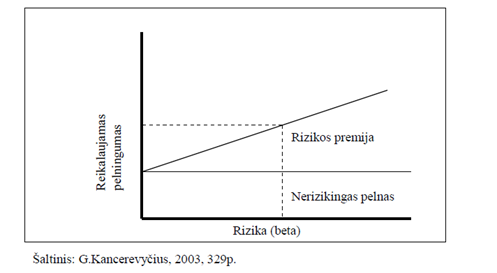

```{r, message=FALSE, echo=FALSE, include=F}
library("quantmod")
library("forecast")
library("xts")
library("dplyr")
library("gridExtra")
library("dynlm")
library("ggplot2")
library("reshape2")
library("knitr")
library("tseries")
library("MASS")
library("car")
library("sandwich")
library("lmtest")
```

\begin{titlepage}

\centerline{\bf \large Vilniaus Universitetas}
\bigskip
\centerline{\large \textbf{Matematikos ir informatikos fakultetas}}

\vskip 120pt
\centerline{\bf \Large \textbf{Kursinis darbas}}
\vskip 50pt
\begin{center}
    {\bf \LARGE Lietuvos akcijų rinkos grąžos priklausomybė nuo makroekonominių duomenų}
\end{center}
\bigskip
\centerline{\Large \textbf{Kursinio vadovas: lektorius dr. Dmitrij Celov}}
\bigskip
\centerline{\Large \textbf{Darbą atliko: Manvydas Sokolovas ir Paulius Kostickis}}
\vskip 90pt
\vskip 120pt
\centerline{\large \textbf{VILNIUS 2016}}
%\newpage
\end{titlepage}

\textwidth 6.5in
\textheight 9.00in

\renewcommand{\contentsname}{Turinys}
\tableofcontents
\thispagestyle{empty}
\newpage

**Santrauka:**

&nbsp;&nbsp;&nbsp;&nbsp;&nbsp; Makroekonomiai rodikliai gali padėti nuspėti ateities verslo ciklą, kuris turi įtakos akcijų pelningumui. Sudarytas „OMX Vilnius“ indekso grąžos prognozavimo modelis naudojant „Arbitražo įkainojimo teorema” (angl. APT), siekiant išsiaiškinti, kokie Lietuvos makroekonominiai rodikliai tiesiškai paveikia „OMX Vilnius“ indekso grąžas. Sukurta pelninga strategija remiantis Lietuvos makro rodikliais ir palyginta su atsitiktiniu investavimu. Tirti mėnesiniai duomenys nuo 2002 iki 2016 metų. Dalis makroekonominių rodiklių yra reikšmingi vertinant indekso kainos pokyčius. 

**Darbe naudojami trumpiniai:**

kk – kasyba ir karjerų eksploatacija
\newline mp – mažmeninė prekyba
\newline vp – verslo plėtros aktyvumas per 3 mėnesius
\newline ta – turimos akcijos
\newline ul – užsakymų lūkesčiai
\newline dll – darbo lygio lūkesčiai
\newline mhope – mažmeninės prekybos pasitikėjimas
\newline shope – statybų pasitikėjimas
\newline phope – paslaugų pasitikėjimas
\newline vhope – vartotojų pasitikėjimas
\newline pramhope – pramonės pasitikėjimas 
\newline gkl – gamintojų kainų lygis
\newline ip – industrinė produkcija

# Įvadas:

&nbsp;&nbsp;&nbsp;&nbsp;&nbsp; Akcijų pokyčiams yra reikšminga ekonomikos būsena. Jei ekonomika auga, tuomet dauguma įmonių padidina savo pelną ir gamybą. Priešingas procesas, kai ekonomika traukiasi. Egzistuoja makroekonominiai rodikliai tokie kaip infliacija, valiutos kursas, palūkanų dydis, kurie gali paaiškinti akcijų grąžas. Tačiau yra atliktas tyrimas Rusijos rinkoje, remiantis arbitražo įkainojimo teorija, kurio tyrimo autorius nesugebėjo rasti reikšmingos makroekonominių duomenų  įtakos akcijų grąžoms. O Šri Lankos ir Indijos rinkoms atlikti empiriniai tyrimai parodė, jog makroekonominiai rodikliai turi įtakos akcijų grąžai. Todėl nutarta ištirti Lietuvos akcijų rinkos grąžos priklausomybę nuo makro rodiklių remiantis Arbitražo įkainojimo teorija (angl. APT)  ir iš daugelių rodiklių atrikti svarbiausius. 
Kylančiose rinkose daug dažniau pasitaiko neteisingai įkainotų finansinių instrumentų nei išvystytose (efektyviose) rinkose. Lietuvos rinką galime priskirti besivystančiosios rinkos kategorijai ir galbūt tyrimo išvadas, naudojant APT, galima bus praktiškai pritaikyti pelningai investuojant. 

# Teorija:

## Rizika ir diversifikavimas:

&nbsp;&nbsp;&nbsp;&nbsp;&nbsp; Investuojant į akcijas, kuo didesnis standartinis nuokrypis, tuo didesnė galimybė prarasti investuotus pinigus. Šiuo atveju rizika bus laikoma standartiniu nuokrypiu. Taigi rizika ir pajamos iš investicijų yra tiesiogiai tarpusavyje susijusios: kuo didesnė rizika, tuo turėtų būti didesnės laukiamas pelnas iš investicijų, kad jos kompensuotų aukštą rizikos lygį. Svarbus tampa reikalaujamas pelningumas – tai mažiausias laukiamas pelnas, kurio yra reikalaujama už investavimą į rizikingą aktyvą. Investuotojas gali rinktis nerizikingą pelną, pirkdamas nerizikingus vertybinius popierius. Ši nerizikinga pelno norma yra minimumas, kurio gali tikėtis investuotojas neprisiimdamas jokios rizikos. Pirkdamas rizikingesnį vertybinį popierių, investuotojas reikalaus rizikos premijos (atpildo už rizikingų vertybinių popierių laikymą. Taigi nerizikinga pelno norma bei rizikos premija sudaro reikalaujamą pelningumą. Ši priklausomybė pavaizduota paveiksle apačioje.


&nbsp;&nbsp;&nbsp;&nbsp;&nbsp; H.Markowitz sukurta portfelio teorija leidžia investuotojams įvertinti riziką ir laukiamas pajamas. Galimą riziką sumažinti, o pelną padidinti, jei bus investuojama į skirtingas įmones, kurių akcijų kainos juda skirtingomis kryptimis. Diversifikacija eliminuoja nesisteminę riziką dėl dviejų priežasčių: atskiros įmonės akcijos sudaro nedidelę dalį portfelyje, todėl poveikis (tiek teigiamas, tiek neigiamas) mažai juntamas.

&nbsp;&nbsp;&nbsp;&nbsp;&nbsp; Rizikai ir pelningumui, jų dinamikai prognozuoti kuriamos skirtingos strategijos, taikomos
techninės ir fundamentalios analizės žinios, kuriami rizikos ir pelningumo modeliai. Darbe įvertinama rizika, kurią prisiima investuotojai investuodami į Lietuvos akcijų rinką ir taip pat apskaičiuojama kokia premija turėtų būti mokama už šios rizikos prisiėmimą.

##Ilgalaikio turto įkainojimo modelis

H.Markowitz sukurta portfelio teorija teigia, kad investuotojui rūpi, kaip gauti kuo daugiau
naudos pasirenkant įvairius vertybinius popierius. Toks portfelis turėtų pasižymėti dvejomis
savybėmis: 1. mažiausiu pelningumu priimtinam rizikos lygiui; 2. mažiausia rizika esant norimam
pelningumui. Tai vieno periodo naudos maksimizavimo būdas. (F. K.Reilly, K. C.Brown, 2000)
William Sharpe toliau pl÷tojo šią teoriją. 1964m. sukurtas kapitalo (ilgalaikio turto) įkainojimo
modelis (toliau CAPM), įvertina pasirinkto vertybinio popieriaus laukiamos grąžos ryšį su rizika. Šis
modelis leidžia įvertinti ne tik pačius rizikingiausius, bet ir mažiau rizikingus vertybinius popierius.
Taigi CAPM esm÷ - parodyti, kokia vertybinio popieriaus rizikos dalis gali arba negali būti sumažinta
diversifikacijos būdu. (Y.A. Javed, p.2)
Autoriai, kurie tiria CAPM (A.R.Strong (2006), L.Gillette (2005)Y.A.Javed bei kiti), teigia, kad
CAPM pasižymi tam tikromis prielaidomis:
1. visi investuotojai siekia pelno;
2. investuotojai n÷ra linkę rizikuoti;
3. grąžos dispersija atitinka rizikos laipsnį;
4. egzistuoja nerizikingas vetybinis popierius, kurį investuotojas gali tiek skolinti, tiek
skolintis neribotom sumom su nerizikinga pelno norma;
5. vertybinių popierių kiekiai yra fiksuoti, lengvai platinami rinkoje ir lengvai dalomi;
6. rinkoje informacija visus dalyvius pasiekia vienu metu, tad ji n÷ra vertinga;
7. laikoma, kad rinkoje n÷ra mokesčių, sandorio kaštų ar kitų apribojimų;
8. rinkoje veikia tobula konkurencija, t.y. vienas investuotojas negali niekaip paveikti
akcijos rinkos kainos;
9. atskirti finansinis ir gamybos sektoriai;
10. n÷ra infliacijos bei nerizikingos palūkanų normos kitimo.
Taikant CAPM praktikoje reikia įvertinti šias prielaidas. Vienos iš jų yra realios (pvz., kai kurie
investuotojai gali būti atleisti nuo mokesčių, įmanoma skolinti pinigus už nerizikingą normą), tačiau
dauguma iš šiam modeliui taikomų prielaidų laikomos nerealiomis (pvz., infialcijos ir palūkanų normos
n÷ra nekintamos, dažniausiai mokami komisiniai tarpininkmas, neįmanoma pasiskolinti už neriikingas
palūkanas ir panašiai). (G.Kancerevyčius, 2003, p. 334)
CAPM modelyje rizika skirstoma į sisteminę ir nesisteminę (šios sąvokos pateiktos 1.2.1.
skyriuje). Sisteminei rizikai skaičiuoti, kaip jau min÷ta anksčiau, naudojamas beta koeficientas, kuris
parodo vertybinio popieriaus jautrumą su rinka, t.y. lyginamas vertybinio popieriaus (portfelio) kitimas
su rinkos kitimu. CAPM teorijos šalininkai tai pat pritaria portfelio diversifikavimui, nes, pasak jų, tik
tokiu būdu galima sumažinti visą nesisteminę riziką. (Y.A. Javed, p.3)
Taigi pagal CAPM modelį pageidaujamas pelningumas apskaičiuojams kaip nerizikingos pelno
normos ir rizikos priedo, įvertinančio vertybinio popieriaus sisteminę riziką, suma (R.Norvaišien÷,
2004, p.33-34):
RRi=Rf + Rizikos premija (4)
Vertybinio popieriaus i rizikos premija lygi finansinio isntrumento i beta koeficiento bei rinkos
rizikos premijos sandaugai (G.Kancerevyčius, 2003, p.329). Taigi 4 lygybę galima užraštyti taip:
RR ( ) i f i f R MR −R (5)
kur: RRi – reikalaujamas (planuojams) pelningumas;
Rf – nerizikinga pelno norma;
βi – finansinio instrumento i beta;
MR – visos rinkos reikalaujamas (planuojamas) pelningumas;
MR-Rf yra rinkos rizikos premija, kuri atspindi papildomą pelningumą.
Iš šios lygyb÷s matyti, kad išaugus beta koeficientui, padid÷ja ir laukiamas pelningumas. Taigi
5 lygtis nustato tiesinę betą ir vertybinio popieriaus pelningumo priklausomybę ir grafiškai (4
paveiksl÷lis) išreiškia vertybinio popieriaus rinkos liniją (SML – security market line).


Taške RF rizikos laipsnis lygus 0. Jei vertybinis popierius yra virš SML (taškas A), tai reiškia,
kad jis neįvertintas. Ir atvirkščiai, jei vertybinis popierius yra žemiau SML, tai reiškia, kad jis
pervertinamas (taškas B). Taigi SML nuolydis atskiram vertybiniam popieriui nesikeičia. SML kreiv÷s
nuolydis keičiasi tik tuo atveju, kai keičiasi visos rinkos investuotojų požiūris į rizikos ir pelningumo
santykį. (G.Kancerevyčius, 2003, p.329)
CAPM modelis patrauklus tuo, jog siūlo puikią galimybę gana patikimai įvertinti riziką bei jos
ryšį su laukiamomis pajamomis. Tam naudojamos pagrindin÷s įgyvendinamos sąlygos: laukiamos
pajamos yra tiesiogiai susijusios su vertybinių popierių β koeficientais; β premija yra teigiama, t.y.
laukiamos rinkos portfelio pajamos viršija laukiamas pajamas iš vertybinių popierių, kurių pajamos
nekoreliuoja su rinka (E. F.Fama, K. R.French, 2004, p.30)
Nors CAPM modelis gana populiarus vertinant vertybinius popierius, tačiau jis turi keletą
trūkumų. Visų pirma, šis modelis remiasi keliomis labai griežtomis ir nerealiomis prielaidomis. Antra,
CAPM buvo sukurtas kaip nekintantis vertybinių popierių vertinimo modelis. To pasekoje, modelis
neatsižvelgia į finansin÷s rinkos dinamiką. Trečia, CAPM modelis buvo sukurtas stengiantis teoriškai
nustatyti ryšį tarp finansinių bei nekilnojamo turto sektorių. (R. J. Torz, 1998)


http://etalpykla.lituanistikadb.lt/fedora/get/LT-LDB-0001:J.04~2007~1367163822251/DS.002.0.

Pagrindinio kapitalo kainos modelis ir jo prielaidos Pagrindinio kapitalo kainos modelis buvo sukurtas, siekiant pagr┊sti skirting┧ aktyv┧ rizikos premijos skirtumus. Pagal CAPM, šiuos skirtumus lemia skirtingas aktyv┧ generuojam┧ pajam┧ rizikingumas. ┉rodinプjama, kad tikslus rizikos matas yra beta, o rizikos premija, tenkanti vienam rizikingumo vienetui, yra 202 tokia pati visiems aktyv┧ tipams. Jeigu yra žinoma laisva nuo rizikos pelno norma ir tam tikro aktyvo koeficientas beta, tai taikant CAPM gali b┣ti nustatoma laukiama aktyvo rizikos premija. Pagrindinプ CAPM lygtis (Jagannathan, McGrattan, 1995): ERi = R0 + (ERm – R0)di (1) 7ia: i = 1,2,…, n; ERi – laukiama i – tojo aktyvo pelno norma; R0 – laisva nuo rizikos pelno norma (ilgalaiki┧ vyriausybプs vertybini┧ popieri┧ pelno norma); ERm – laukiama rinkos portfolio pelno norma; di – i – tojo aktyvo beta. Pagrindinio kapitalo kainos modelio lygtis rodo, kad vis┧ aktyv┧ i, kuri┧ rizika yra lygi di , pageidaujama rizikos premija yra tokia pati – lygi laukiamos pelno normos ir laisvos nuo rizikos pelno normos skirtumui, t.y. (ERi – R0). CAPM yra paremtas Markowitz (1952) portfelio teorija. Tariama, kad kiekvienas investuotojas diversifikuoja savo aktyv┧ portfel┊, pasirinkdamas jam priimtin> rizikos ir pelno normos derin┊. Siekiant supaprastinti sudプting> išorinC aplink>, priimtos papildomos CAPM prielaidos: 1. Investuotojai laukiam> pelno norm> ir rizik> vertina vienoda tikimybe. Taigi visi investuotojai disponuoja ta pa7ia informacija apie rinkoje cirkuliuojan7ius aktyvus; 2. Investavimo perspektyvos – vienas periodas (vieneri metai); 3. Investuotojai vengia rizikos; 4. Visi investuotojai gali skolintis arba skolinti neribot> apimt┊ pinigini┧ lプš┧ nustatytu laisvu nuo rizikos pelno normos tarifu. Šios pal┣kanos nekinta ilgesn┊ laikotarp┊; 5. Sandori┧ kaštai yra lyg┣s nuliui, nプra infliacijos, nプra diferencijuot┧ mokes7i┧; 6. Rinkoje veikia daug investuotoj┧, todプl pavieniai investuotojai, vykdydami pirkimo-pardavimo sandorius, negali turプti ┊takos aktyv┧ kainai; 7. Investuotojai siekia maksimaliai padidinti savo laukiam> peln> per vien> investavimo period>, esant duotam ar žemesniam rizikos lygiui; 8. Kapitalo rinka yra pusiausvyra; 9. Investicij┧ ┊vertinimui taikomi rodikliai – pelno normos vidurkis ir dispersija. CAPM ┊monプs vadovams padeda suprasti kaip investuotojai vertina potenciali┧ investicini┧ galimybi┧ rizikingum>. Tai didina resurs┧ panaudojimo efektyvum>. Jeigu pagrindinio kapitalo kainos modelis tinkamai ┊vertina investuotoj┧ elgsen>, tai analizuojant istorinius duomenis turプt┧ b┣ti nustatytas teigiamas tiesinis ryšys tarp vidutinプs finansini┧ aktyv┧ pelno normos ir j┧ betos. Be to, turプt┧ neegzistuoti joks kitas matas, kurio pagalba b┣t┧ paaiškinti CAPM betos nepagr┊sti finansini┧ aktyv┧ vidutini┧ pelno norm┧ skirtumai.
Aktyvų įkainojimo teorija (APT)
CAPM pagrindu buvo kuriami ir tobulinami kiti aktyvų įkainojimo modeliai, kurie galėjo turėti mažiau apribojimų ir prielaidų, taip pat turėti ir daugiau įtakojančių rodiklių. Vienas iš patobulintų CAPM yra APT.  1966 m. atsirado pirmosios arbitražo įkainojimo teorijos
idėjos, kai B. F. King (1966) pradėjo finansinių aktyvų grąžos pokyčius aiškinti ekonominiais duomenimis. Tačiau APT teorijos kūrėju yra laikomas S. A. Ross (1976), kuris pateikė  teorijai reikiamas prielaidas ir matematiškai pagrindė koncepciją. Šios teorijos pagrindas yra panašus, kaip ir CAPM, t. y. investuotojai reikalauja rizikos premijos už nediversifikuotos (sisteminės) rizikos prisisėmimą. Tačiau arbitražo įkainojimo teorijos naudingumas yra tas, jog galima įtraukti kitus sisteminės rizikos  šiame darbe yra tas, jog galime ištirti  . Taip pat APT prielaidos yra paprastesnės ir realistiškesnės. 

## APT taikymo prielaidos:

1) finansų rinkos apibūdinamos kaip tobulos ir
efektyvios;
2) apibrėžtumo atveju investuotojai visada teiks
pirmenybę didesnio pelningumo portfeliui;
3) egzistuoja tam tikros svarbios sisteminės rizikos,
kurios tiesiškai veikia aktyvų pelningumą,
t. y. aktyvų pelningumus generuojantį stochastinį
procesą galima išreikšti kaip n rizikos
faktorių ar indeksų tiesinę kombinaciją; be to,
investuotojai tas rizikas suvokia ir gali įvertinti
aktyvo jautrumą toms rizikoms;
4) ekonomikoje yra agresyvių investuotojų, kurie išnaudos aktyvų numatomų
pelningumų skirtumus pasinaudodami
arbitražu.

Šios prielaidos bus taikomos modelyje.
 
 1 pav. Juoda  tiese B yra S&P 500  indekso vertybinių
popierių rinkos tiesė (SML), taškas A yra portfelis, kuris yra
aukščiau tiesės. Kai rinka pasiekusi pusiausvyrą,
remiantis CAPM tokia situacija neįmanoma, nes
galimas tik vienas visiems prieinamas optimalus
portfelis. Tačiau pavaizduota situacija yra praktiškai galima.. A portfelio grąžos vidurkis gali būti didesnis nei SML grąžos vidurkis fiksuotam Beta dydžiui.

Šis aktyvų įkainojimo modelis yra grindžiamas tuo, jog aktyvo pelningumą galima numatyti  naudojant analizuojamo aktyvo ir daugelio įprastų rizikos faktorių tarpusavio ryšį. Sukurta S. Ross (1976) arbitražo įkainojimo teorija numato ryšį tarp atskiro aktyvo pelningumo ir portfelio pelningumo pasitelkiant daugelio nepriklausomų kintamųjų (makroekonominių faktorių, tokių kaip infliacija, ekonomikos augimas, tarptautinės gamybos apimtis, palūkanų normos ir t.t.) tiesinę kombinaciją. APT paaiškina aktyvo kainą, kai tikėta, kad aktyvas yra neteisingai įkainotas. Tuo tikslu naudojami rizikingo aktyvo pelningumas ir keleto makroekonominių faktorių rizikos premijos. Taigi investuotojai pasitelkia šią įkainojimo teoriją, siekdami pasipelnyti iš neteisingai įvertintų (dažniausiai nepakankamai įvertintų) aktyvų. Tačiau neteisingai įkainoto aktyvo kaina skirsis nuo tos, kuri nustatoma šio modelio dėka. Tokiu būdu investuotojai, norintys pasinaudoti arbitražu ir gauti faktiškai nerizikingą pelną, sieks palaikyti trumpas pervertinto aktyvo pozicijas ir kartu laikyti ilgas portfelio (kurio pagrindu yra atliekami APT skaičiavimai) pozicijas.

Jei APT prielaidos patenkinamos, tuomet laukiami pelningumai bus išsidėstę arti SML, o aktyvas turės tiek rizikos charakteristikų, kiek yra faktorių. APT teorijos prielaidos yra artimesnės realybei, nes ne visi investuotojai elgiasi vienodai rinkoje, net jei jų elgsena grindžiama racionalumu, t. y. APT nereikalauja CAPM prielaidų tenkinimo dėl investuotojų naudingumo funkcijų. Be to, ne kiekvienas investuotojas yra linkęs turėti rinkos portfelį kaip vienintelę alternatyvą, t. y. APT nereikalauja CAPM prielaidos tenkinimo dėl rinkos portfelio savybių (kad jis apima visus rizikingus aktyvus ir yra efektyvus vidurkio-dispersijos prasme). Juk rinkoje yra ir kitų rizikingų aktyvų, t. y. kapitalo rinkose daug agresyvių investuotojų. Ši prielaida patvirtinama 1 pav. duomenimis.

Naudodami Lietuvos makro duomenis, matuojame  rizikos premijas, kurias gauname už riziką investuojant Lietuvos rinkoje. Makroduomenys iliustruoja Lietuvos ekonominę būklę.

\newpage

# Duomenų transformacijos
Duomenys naudojami nuo 2002 metų iki 2016 metų, ankstesnių duomenų nepavyko išgauti.

OMX Vilnius indeksas transformuojamas į mėnesinius procentinius pokyčius: jei OMX indekso mėnesinė kaina nuo laiko (mėnesio)  t žymėsime *X(t)*, tai *r(t)* = (log(*X(t)*) – log(*X(t-1)*) ) $\times$ 100 %, čia *r(t)* yra indekso mėnesinis pokytis procentais.
Tokiu pačiu būdu gaunama kitų akcijų indeksų grąža logaritmuojant ir diferencijuojant S&P500, S&P350 indeksų kainas. Kasybos ir karjerų eksploatacijos indeksas, mažmeninės prekybos indeksas, industrinės produkcijos indeksas yra taip pat logaritmuojami ir diferencijuojami. Visi logaritmuoti duomenys padauginami iš šimto, kad pokytis būtų interpretuojamas procentais. Euribor yra dalinamas iš 12 ir diferencijuojamas, kad būtų gautas mėnesinis pokytis. Nedarbas dalinamas iš 10 (bedarbių skaičius tenkantis 1000 gyventojų, padalinę iš 10 gauname procentais) ir taip pat yra diferencijuojamas. Dolerio/euro valiutų kursas, pasitikejimo ir lūkesčių rodikliai yra diferencijuojami. Diferencijavimu šiuo atveju vadiname šio mėnesio duomenų atėmimą iš praeito periodo(mėnesio) duomenų.

Tikrinami duomenys po transformacijų ar turi vienetinę šaknį (stacionarumo tikrinimas), atliekamas Dickey-Fuller testas:
```{r, message=FALSE, echo=FALSE}
data=read.csv("rawdata.csv")


data[ data == ":" ] = NA
data=data[complete.cases(data),]
rownames(data)<-NULL
```

```{r, message=FALSE, echo=FALSE,warning =FALSE}
data2=apply(data[,-1],2,as.numeric)
rownames(data2)=data[,1]
data2=data.frame(data2)
data2$nedarbas=data2$nedarbas/10

data2[,c("OMX","SP350","SP500","kk","mp","ip")] = apply(data2[,c("OMX","SP350","SP500","kk","mp","ip")],2,log)    #logaritmuojama indeksai, akcijų kainos, kursas  


data2$euribor=((data2$euribor+1)^(1/12)-1)*12                    #reiketu gal menesio?
names(data2)[names(data2) == 'euribor'] <- 'palukanos'

data3=data.frame(diff(as.matrix(data2)))  
data3$euribor=data2$euribor[-1]
names(data3)[names(data3) == 'euribor'] <- 'palukanos'
data3$gkl = data$gkl[-1]    #gamintoju kainu lygio nereik diferencijuot nes jau yra pokytis %
#tsdisplay(data3$infliacija)

p=apply(data3[,],2,function(i)adf.test(i,k=1)$p.value)
p=data.frame(p)
p[,1] = round(p[,1], digits = 2)
kable(p)

data3$OMX=data3$OMX-data3$palukanos
data3$SP350=data3$SP350-data3$palukanos
data3$SP500=data3$SP500-data3$palukanos
```

* Visų kintamųjų, išskyrus infliaciją, p - value mažiau už 0.05, galime atmesti H0, kad turi vienetinę šaknį, visi kintamieji, išskyrus infliaciją, yra stacionarūs.

\newpage

# Duomenų vizualizacija

```{r, message=FALSE, echo=FALSE}
panel.hist <- function(x, ...)    #ši funkcija reikalinga grafikų lentelei išbrėžti (histogramos pateikimui)                        
{
  usr <- par("usr"); on.exit(par(usr))
  par(usr = c(usr[1:2], 0, 1.5) )
  h <- hist(x, plot = FALSE)
  breaks <- h$breaks; nB <- length(breaks)
  y <- h$counts; y <- y/max(y)
  rect(breaks[-nB], 0, breaks[-1], y, col = "cyan", ...)
}

panel.cor2 <- function(x, y, digits=2, cex.cor)
{
  usr <- par("usr"); on.exit(par(usr))
  par(usr = c(0, 1, 0, 1))
  r <- abs(cor(x, y))
  txt <- format(c(r, 0.123456789), digits=digits)[1]
  test <- cor.test(x,y)
  Signif <- ifelse(round(test$p.value,3)<0.001,"p<0.001",paste("p=",round(test$p.value,3)))  
  text(0.5, 0.25, paste("r=",txt))
  text(.5, .75, Signif)
}
panel.cor <- function(x, y, digits = 2, prefix = "", cex.cor,...)    #ši funkcija reikalinga grafikų lentelei
    #išbrėžti (koreliacijos koeficiento radimui)
{
  usr <- par("usr"); on.exit(par(usr))
  par(usr = c(0, 1, 0, 1))
  r <- abs(cor(x, y))
  txt <- format(c(r, 0.123456789), digits = digits)[1]
  txt <- paste0(prefix, txt)
  if(missing(cex.cor)) cex.cor <- 0.8/strwidth(txt)
  text(0.5, 0.5, txt, cex = 3)
}
```


```{r, message=FALSE, echo=FALSE}
Data = rownames(data3)
Data=as.yearmon(Data, "%YM%m")

data3=cbind.data.frame(Data, data3)
```


<br>

Akcijų indeksų mėnesiniai procentiniai pokyčiai:

```{r, message=FALSE, echo=FALSE,warning=F}
Sys.setlocale(locale = "en_LT.UTF-8")
akc = melt(data3[,c("OMX","SP350","SP500","Data")], id=c("Data"))
ggplot(akc) + geom_line(aes(x=Data, y=value, colour=variable)) +
  scale_colour_manual(values=c(1:4))+ylab("% pokytis")+
  guides(col=guide_legend(title="Kintamieji")) +
  ggtitle("Akcijų indeksų mėnesiniai grąžų pokyčiai")
```

* Tikėtina, jog S&P350 ir S&P500 indeksų svyravimai tūrėtų būti labai panašūs, taigi pažiūrėjus į grafiką galime matyti, jog jų kreivės juda panašiai, tai yra šie dydžiai stipriai koreliuoti.
* OMX Vilnius kreivės svyravimai panašūs, tačiau nevisai sutampa su S&P indeksų. Todėl galima manyti, jog šie dydžiai yra gana silpnai koreliuoti.

\newpage

Akcijų rinkų koreliacija:

```{r, message=FALSE, echo=FALSE}
pairs(data3[,c("OMX","SP350","SP500")],upper.panel=panel.smooth,diag.panel=panel.hist, lower.panel=panel.cor2)
```

* S&P350 ir S&P500 indeksų koreliacija reikšminga ir jie stipriai koreliuoja. Europos ir JAV akcijų rinkų svyravimai yra glaudžiai susiję.
* Kaip ir teigta anksčiau OMX Vilnius koreliacija su S&P indeksais yra reikšminga, tačiau nėra didelė. Nesimato stiprios įtakos iš lyderiaujančių pasaulio rinkų.

\newpage

Kintamųjų koreliacija su OMX Vilnius. r - koreliacijos koeficientas, p - koreliacijos reiksmingumas:

```{r, message=FALSE, echo=FALSE}
pairs(data3[,c("OMX","infliacija","nedarbas","kursas")],upper.panel=panel.smooth,diag.panel=panel.hist, lower.panel=panel.cor2)
```

```{r, message=FALSE, echo=FALSE}
pairs(data3[,c("OMX","mhope","phope","vhope","pramhope","vp")],upper.panel=panel.smooth,diag.panel=panel.hist, lower.panel=panel.cor2)
```

* Kaip ir buvo tikėtasi tarp kintamųjų ir OMX Vilnius rasta nestipri koreliacija, tačiau reikšminga. 

\newpage

# Modeliavimas

```{r, message=FALSE, echo=FALSE}
ccfvalues <- ccf(data3$OMX,data3$SP350)
ccfvalues
modelis = lm(OMX ~ lag(SP350,1) + lag(kk,1) + lag(dll,1) + nedarbas + lag(infliacija,2) + lag(infliacija,3) + lag(infliacija,5) + lag(infliacija,7) + lag(infliacija,8) +lag(mhope,3) + lag(phope,12) + lag(pramhope,3) + lag(shope,4) + lag(ul,10) + lag(vhope,4) + lag(vp,0) + lag(mp,1) + lag(gkl,9) + lag(ip,0) + lag(ip,1) + lag(ip,4) + lag(kursas,2) , data=data3)

modelis_po_aic <- lm(formula = OMX ~ lag(SP350, 1) + lag(infliacija, 2) + lag(mhope, 3) + lag(phope,12) + lag(ul, 10) + lag(gkl, 9) + lag(ip, 4) + lag(kursas,2), data = data3)

coeftest(modelis_po_aic, vcov=vcovHC)
summary(modelis_po_aic)

```


```{r, message=FALSE, echo=FALSE}
datafr=data.frame(summary(modelis_po_aic)[c(4,8)] %>%  lapply(round,2))
colnames(datafr)=c("koeficientai","standartinis nuokrypis","koeficientu t reikšmes","p reiksme", "R kvadratas")

datafr[2:nrow(datafr),"R kvadratas"]="-"
kable(datafr)
```

* Sudarytas modelis iš visų kintamųjų, atliktas stepAIC.  Didelė dalis makroekonominių duomenų buvo nereikšmingi, tačiau aptikome ir keletą reikšmingų kintamųjų. Modelis paaiškina apie 25% procentus OMX Vilnius indekso grąžos pokyčių.

\newpage

# Literatūra

1) „TESTS OF THE ARBITRAGE PRICING THEORY USING MACROECONOMIC VARIABLES IN THE RUSSIAN EQUITY MARKET“ - Mauri Paavola:
[link](http://www.doria.fi/bitstream/handle/10024/30869/TMP.objres.246.pdf)

2) „Introductory Econometrics for Finance“ - Chris Brooks

3) „Relationship between Macro – Economic Variables and Stock Market Performance of Colombo Stock Exchange“ - Prabath Suranga Morawakage:
[link](https://www.researchgate.net/profile/Prabath_Morawakage/publication/263659272_Relationship_between_Macro_-_Economic_Variables_and_Stock_Market_Performance_of_Colombo_Stock_Exchange/links/0f31753b8d1bfe46cb000000.pdf)

4) „Do macro-economic variables explain stock-market returns? Evidence using a semi-parametric approach“ - Sagarika Mishra:
[link](https://papers.ssrn.com/sol3/papers.cfm?abstract_id=1937914)

5) "Vertybinių popierių rizikos ir pelningumo modelių įvertinimas" - Aistė Launagaitė:
[link](http://vddb.library.lt/fedora/get/LT-eLABa-0001:E.02~2007~D_20140626_161610-48318/DS.005.0.01.ETD)

Kryžminė koreliacija:
```{r}
names2=c("SP350","SP500","kk","dll","nedarbas","infliacija","mhope","phope","pramhope","shope","ta","ul","vhope","vp","mp","palukanos","gkl","ip","kursas")

for (i in 3:length(data3[1,])){
ccfvalues <- ccf(data3$OMX,data3[,i]) #aiskinames laga
print(names2[i-2])
print(ccfvalues)

}
```

Atrinkti lagai pagal didžiausią koreliaciją su OMX ir sudarytas modelis:
```{r}
modelis2 = lm(OMX ~ lag(SP350,0) + lag(kk,1) + lag(dll,1) + lag(nedarbas,5) + lag(mhope,3) + lag(phope,12) + lag(pramhope,3) + lag(shope,1) + lag(ul,10) + lag(vhope,4) + lag(vp,1) + lag(mp,1) + lag(gkl,19) + lag(ip,4) + lag(kursas,2) , data=data3)


modelis_po_aic <- lm(formula = OMX ~ lag(SP350, 1) + lag(nedarbas, 5) + lag(infliacija, 4) + 
    lag(mhope, 3) + lag(phope, 12) + lag(pramhope, 3) + lag(ul,10) + lag(vhope, 4) + lag(mp, 1) + lag(gkl, 19) + lag(ip,4) + lag(kursas, 2), data = data3)
```


Atrinkti lagai:
```{r}
ccfvalues <- ccf(data3$OMX,data3$kursas)
ccfvalues
modelis = lm(OMX ~ lag(SP350,0) + lag(kk,1) + lag(dll,1) + nedarbas + lag(mhope,3) + lag(phope,12) + lag(pramhope,3) + lag(shope,4) + lag(ul,10) + lag(vhope,4) + lag(vp,0) + lag(mp,1) + lag(gkl,9) + lag(ip,0) + lag(ip,1) + lag(ip,4) + lag(kursas,0) + lag(kursas,2) , data=data3)

y<-data3$OMX
x<-as.matrix(data3[,3:21])
a<-lars(y, x, type = c("lasso", "lar", "forward.stagewise", "stepwise"))
lars(x, y, type = c("lasso", "lar", "forward.stagewise", "stepwise"),
trace = FALSE, normalize = TRUE, intercept = TRUE, eps = .Machine$double.eps, max.steps = 160, use.Gram = TRUE)

boo<-stepAIC((modelis))

modelis_po_aic <- lm(formula = OMX ~ lag(SP350, 0) + lag(mhope, 3) + lag(phope, 12) + lag(pramhope, 0) + lag(ul, 10) + lag(mp, 1) + lag(gkl, 9) + lag(kursas, 2)   , data = data3)

coeftest(modelis_po_aic, vcov=vcovHC)
summary(modelis_po_aic)
```

```{r}
res<-bptest(modelis_po_aic)
```


```{r}
ncvTest(modelis_po_aic)
# Kadangi p-value > 0.05, tai H0 hipotezė priimama - duomenys homoskedastiški.
spreadLevelPlot(modelis_po_aic)
vif(modelis_po_aic)
```

Tikrinama autokoreliacija:

```{r}

durbinWatsonTest(modelis_po_aic)
# p-value > 0.05 - liekanos nėra autokoreliuotos.

Box.test(modelis_po_aic$res, fitdf=0, type="Lj")
#p-value >0.05, vadinasi H0 neatmetama. Galima teigti, kad liekanos yra baltasis triukšmas.
```

```{r}
shapiro.test(modelis_po_aic$residuals)
# p-value > 0.05 - liekanos yra normalios
```


```{r}
pirkti=numeric()

gen=function(pradzia,pirkti){
b=sample(pradzia:169,length(pirkti),replace=F)
return(sum(data3[b,"OMX"]))
}

validation=function(pradzia){
pirkti=numeric()
for(i in pradzia:168){
  modelis_po_aic <- lm(formula = OMX ~ lag(SP350, 1) + lag(infliacija, 2) + lag(mhope, 3) + lag(phope,12) + lag(ul, 10) + lag(gkl, 9) + lag(ip, 4) + lag(kursas,2), data = data3[1:i,c("OMX","SP350","infliacija","mhope","phope","ul","gkl","ip","kursas")])
  a=predict(modelis_po_aic, data3[1:i+1,])
  a=a[length(a)]
  if(matrix(a)[1]>5){pirkti=append(pirkti,i)}

}

graza=sum(data3[pirkti,"OMX"])
random=replicate(100000,gen(pradzia,pirkti))
p=mean(random>graza)
vidurkis_random = mean(random)
if(p==0){p="nebuvo pirkimu"}
else{
  p=append(p,graza)
  p=append(p,vidurkis_random)
  }
return(p)                               
}
validation(90) #kai pradine imtis 70, atsakymo prasme- tikimybe kad geriau uz random, graza strategijos, vidutine random graza
```


```{r}
ccfvalues <- ccf(data3$OMX,data3$pramhope)
ccfvalues
modelis = lm(OMX ~ lag(SP350,0) + lag(kk,1) + lag(kk,8) + lag(dll,1) + nedarbas + lag(mhope,3) + lag(phope, 12) + lag(phope,0) + lag(pramhope,0)+ lag(shope,1) + lag(ul,10) + lag(vhope,4) + lag(vp,0) + lag(mp,1) + lag(gkl,9) + lag(ip,4) + lag(ip,1) + lag(kursas,2) , data=data3)

boo<-stepAIC((modelis))

modelis_po_aic <- lm(formula = OMX ~ lag(SP350, 0) + lag(mhope, 3) + lag(phope, 12) + lag(pramhope, 0) + lag(ul, 10) + lag(mp, 1) + lag(gkl, 9) + lag(kursas, 2) , data = data3)

ncvTest(modelis_po_aic)
# Kadangi p-value > 0.05, tai H0 hipotezė priimama - duomenys homoskedastiški.
coeftest(modelis_po_aic, vcov=vcovHC)
summary(modelis_po_aic)
```


```{r, +++ SP350, 0.5356981(8.282e-05) -> 0.5632657(0.0001001)}
# KORELIACIJA:
names2=names(data3[,-c(1,2)])

for (i in 3:length(data3[1,])){
ccfvalues <- ccf(data3$SP350,data3[,i]) #aiskinames laga
print(names2[i-2])
print(ccfvalues)
}

# TEST KINT MODELIS:
mod_sp350 = lm( SP350 ~ lag(kk,0) + lag(kk,13) + lag(dll,1) + lag(nedarbas,0) + lag(mhope,0) + lag(phope,1) + lag(pramhope,2) + lag(shope,8) + lag(shope,0) + lag(shope,1) + lag(ul,1) + lag(vhope,2) + lag(vp,0) + lag(mp,4) + lag(gkl,5) + lag(ip,13)  + lag(kursas,0), data=data3)
# ccf: kursas - 0.597; 

stepAIC(mod_sp350)$anova

mod_po_aic_sp350 = lm(SP350 ~ lag(kk, 0) + lag(shope, 8) + lag(vhope, 2) + lag(vp, 0) + lag(mp, 4) + lag(gkl, 5) + lag(ip, 13) + lag(kursas,0), data=data3)

ncvTest(mod_po_aic_sp350)
# Kadangi p-value > 0.05, tai H0 hipotezė priimama - duomenys homoskedastiški.

coeftest(mod_po_aic_sp350, vcov=vcovHC)

summary(mod_po_aic_sp350)

# PAGR MOD PLIUS PAPILDOMI KINTAMIEJI:
modelis_po_aic <- lm(formula = OMX ~ lag(SP350, 0) + lag(mhope, 3) + lag(phope, 12) + lag(pramhope, 0) + lag(ul, 10) + lag(mp, 1) + lag(gkl, 9) + lag(kursas, 2)  
                     +
                      lag(kk, 0) + lag(shope, 8) + lag(vhope, 2) + lag(vp, 0) + lag(ip, 13)  # +0 lago, nes SP350 lag(0)
                     , data = data3)

ncvTest(modelis_po_aic)
# Kadangi p-value > 0.05, tai H0 hipotezė priimama - duomenys homoskedastiški.

coeftest(modelis_po_aic, vcov=vcovHC)

summary(modelis_po_aic)
```

```{r, + mazmenines prekybos pasitikejimas,  0.1876504(0.061922) -> 0.3163326(0.036232)}
# KORELIACIJA:
names2=c("SP350","SP500","kk","dll","nedarbas","infliacija","mhope","phope","pramhope","shope","ta","ul","vhope","vp","mp","palukanos","gkl","ip","kursas")

for (i in 3:length(data3[1,])){
ccfvalues <- ccf(data3$mhope,data3[,i]) #aiskinames laga
print(names2[i-2])
print(ccfvalues)
}

# TEST KINT MODELIS:
mod_mhope = lm( mhope ~ lag(SP350,2)+ lag(kk,0) + lag(dll,0) + lag(nedarbas,0) + lag(phope,0) + lag(pramhope,13) + lag(shope,1) + lag(ul,0) + lag(vhope,1) + lag(vp,0) + lag(mp,11) + lag(gkl,10) + lag(ip,8) + lag(kursas,2), data=data3)
#ccf: dll - 0.370; shope - 0.350; ul - 0.420; vp - 0.694;

a<-stepAIC(mod_mhope)

mod_po_aic_mhope = lm(mhope ~ lag(SP350, 2) + lag(nedarbas, 0) + lag(pramhope, 13) + lag(ul, 0) + lag(vhope, 1) + lag(vp, 0) + lag(gkl, 10) + lag(ip, 8), data=data3)

ncvTest(mod_po_aic_mhope)
# Kadangi p-value > 0.05, tai H0 hipotezė priimama - duomenys homoskedastiški.

coeftest(mod_po_aic_mhope, vcov=vcovHC)
summary(mod_po_aic_mhope)

# PAGR MOD PLIUS PAPILDOMI KINTAMIEJI:
modelis_po_aic <- lm(formula = OMX ~ lag(SP350, 0) + lag(mhope, 3) + lag(phope, 12) + lag(pramhope, 0) + lag(ul, 10) + lag(mp, 1) + lag(gkl, 9) + lag(kursas, 2)    
                     +
                      lag(nedarbas, 3) + lag(ul, 3) + lag(vhope, 4) + lag(vp, 3) + lag(ip, 11) # +3 lago, nes mhope lag(3)
                     , data = data3)

ncvTest(modelis_po_aic)
# Kadangi p-value > 0.05, tai H0 hipotezė priimama - duomenys homoskedastiški.

coeftest(modelis_po_aic, vcov=vcovHC)
summary(modelis_po_aic)
```

```{r, + paslaugu pasitikejimas,  0.1055229(0.222011) -> 0.175638(0.04838)}
# KORELIACIJA:
names2=c("SP350","SP500","kk","dll","nedarbas","infliacija","mhope","phope","pramhope","shope","ta","ul","vhope","vp","mp","palukanos","gkl","ip","kursas")

for (i in 3:length(data3[1,])){
ccfvalues <- ccf(data3$phope,data3[,i]) #aiskinames laga
print(names2[i-2])
print(ccfvalues)
}

# TEST KINT MODELIS:
mod_phope = lm( phope ~ lag(SP350,5)+ lag(kk,1) + lag(dll,0) + lag(nedarbas,0) + lag(mhope,0) + lag(pramhope,1) + lag(shope,0) + lag(ul,0) + lag(ul,11) + lag(vhope,3) + lag(vp,0) + lag(mp,1) + lag(gkl,9) + lag(ip,1) + lag(kursas,0), data=data3)
 

stepAIC(mod_phope)

mod_po_aic_phope = lm(phope ~ lag(dll, 0) + lag(mhope, 0) + lag(pramhope, 1) + lag(shope, 0) + lag(ul, 11) + lag(mp, 1) + lag(gkl, 9) + lag(ip, 1) + lag(kursas, 0), data=data3)

ncvTest(mod_po_aic_phope)
# Kadangi p-value > 0.05, tai H0 hipotezė priimama - duomenys homoskedastiški.

coeftest(mod_po_aic_phope, vcov=vcovHC)
# kursas - 0.250483; gkl - 0.130066
summary(mod_po_aic_phope)

# PAGR MOD PLIUS PAPILDOMI KINTAMIEJI:
modelis_po_aic <- lm(formula = OMX ~ lag(SP350, 0) + lag(mhope, 3) + lag(phope, 12) + lag(pramhope, 0) + lag(ul, 10) + lag(mp, 1) + lag(gkl, 9) + lag(kursas, 2)    
                     +
                      lag(dll, 12) + lag(mhope, 12) + lag(pramhope, 13) + lag(shope, 12) + lag(ul, 23) + lag(mp, 13) + lag(gkl, 21) + lag(ip, 13) + lag(kursas, 12) # +12 lago ,nes phope uzlagintas 12
                     , data = data3)

ncvTest(modelis_po_aic)
# Kadangi p-value > 0.05, tai H0 hipotezė priimama - duomenys homoskedastiški.

coeftest(modelis_po_aic, vcov=vcovHC)

summary(modelis_po_aic)

```

```{r, + pramones pasitikejimas, 0.2407311(0.060074) -> 0.266491(0.022141)}
# KORELIACIJA:
names2=c("SP350","SP500","kk","dll","nedarbas","infliacija","mhope","phope","pramhope","shope","ta","ul","vhope","vp","mp","palukanos","gkl","ip","kursas")

for (i in 3:length(data3[1,])){
ccfvalues <- ccf(data3$pramhope,data3[,i]) #aiskinames laga
print(names2[i-2])
print(ccfvalues)
}

# TEST KINT MODELIS:
mod_pramhope = lm( pramhope ~ lag(SP350,1)+ lag(kk,11) + lag(dll,10) + lag(nedarbas,8) + lag(mhope,0) + lag(phope,0) + lag(shope,0) + lag(ul,0) + lag(vhope,1) + lag(vp,9) + lag(mp,10) + lag(gkl,3) + lag(ip,4) + lag(kursas,2), data=data3)
 

stepAIC(mod_pramhope)

mod_po_aic_pramhope = lm(pramhope ~ lag(SP350, 1) + lag(kk, 11) + lag(dll, 10) + lag(shope, 0) + lag(ul, 0) + lag(vhope, 1) + lag(gkl, 3) + lag(ip, 4), data=data3)

ncvTest(mod_po_aic_pramhope)
# Kadangi p-value > 0.05, tai H0 hipotezė priimama - duomenys homoskedastiški.

coeftest(mod_po_aic_pramhope, vcov=vcovHC)
summary(mod_po_aic_pramhope)

# PAGR MOD PLIUS PAPILDOMI KINTAMIEJI:
modelis_po_aic <- lm(formula = OMX ~ lag(SP350, 0) + lag(mhope, 3) + lag(phope, 12) + lag(pramhope, 0) + lag(ul, 10) + lag(mp, 1) + lag(gkl, 9) + lag(kursas, 2)    
                     +
                       lag(kk, 11) + lag(dll, 10) + lag(shope, 0) + lag(ul, 0) + lag(vhope, 1) + lag(ip, 4) # +0 lago ,nes pramhope uzlagintas 
                     , data = data3)

ncvTest(modelis_po_aic)
# Kadangi p-value > 0.05, tai H0 hipotezė priimama - duomenys homoskedastiški.

coeftest(modelis_po_aic, vcov=vcovHC)

summary(modelis_po_aic)

```

```{r, +- uzsakymu lukesciai,  0.0443947(0.063816) -> 0.049279(0.079453)}
# KORELIACIJA:
names2=c("SP350","SP500","kk","dll","nedarbas","infliacija","mhope","phope","pramhope","shope","ta","ul","vhope","vp","mp","palukanos","gkl","ip","kursas")

for (i in 3:length(data3[1,])){
ccfvalues <- ccf(data3$ul,data3[,i]) #aiskinames laga
print(names2[i-2])
print(ccfvalues)
}

# TEST KINT MODELIS:
mod_ul = lm( ul ~ lag(SP350,4)+ lag(kk,0) + lag(dll,0) + lag(nedarbas,0) + lag(mhope,0) + lag(phope,1) + lag(pramhope,1) + lag(shope,1) + lag(vhope,1) + lag(vp,9) + lag(mp,11) + lag(gkl,10) + lag(ip,4)  + lag(kursas,2) + lag(kursas,14), data=data3)
# ccf: dll - 0.446;  mhope - 0.420; shope - 0.337;

stepAIC(mod_ul)

mod_po_aic_ul = lm(ul ~ lag(dll, 0) + lag(mhope, 0) + lag(phope, 1) + lag(pramhope, 1) + lag(vp, 9) + lag(mp, 11) + lag(ip, 4) + lag(kursas, 14), data=data3)

ncvTest(mod_po_aic_ul)
# Kadangi p-value > 0.05, tai H0 hipotezė priimama - duomenys homoskedastiški.

coeftest(mod_po_aic_ul, vcov=vcovHC)
summary(mod_po_aic_ul)

# PAGR MOD PLIUS PAPILDOMI KINTAMIEJI:
modelis_po_aic <- lm(formula = OMX ~ lag(SP350, 0) + lag(mhope, 3) + lag(phope, 12) + lag(pramhope, 0) + lag(ul, 10) + lag(mp, 1) + lag(gkl, 9) + lag(kursas, 2)   
                     +
                      lag(dll, 10) + lag(vp, 19) + lag(ip, 14) # +10 lago, nes ul lag(10)
                     , data = data3)

ncvTest(modelis_po_aic)
# Kadangi p-value > 0.05, tai H0 hipotezė priimama - duomenys homoskedastiški.

coeftest(modelis_po_aic, vcov=vcovHC)

summary(modelis_po_aic)
```

```{r, + mažmeninė prekyba,  0.1027893(0.062576) -> 0.113830(0.035405)}
# KORELIACIJA:
names2=c("SP350","SP500","kk","dll","nedarbas","infliacija","mhope","phope","pramhope","shope","ta","ul","vhope","vp","mp","palukanos","gkl","ip","kursas")

for (i in 3:length(data3[1,])){
ccfvalues <- ccf(data3$mp,data3[,i]) #aiskinames laga
print(names2[i-2])
print(ccfvalues)
}

# TEST KINT MODELIS:
mod_mp = lm( mp ~ lag(SP350,8)+ lag(kk,0) + lag(dll,0) + lag(nedarbas,1) + lag(mhope,1) + lag(phope,1) + lag(pramhope,2) + lag(shope,2) + lag(ul,1) + lag(vhope,11) + lag(vp,11) + lag(gkl,0) + lag(ip,9) + lag(kursas,0), data=data3)

stepAIC(mod_mp)

mod_po_aic_mp = lm(mp ~ lag(SP350, 8) + lag(kk, 0) + lag(dll, 0) + lag(phope, 1) + lag(shope, 2) + lag(ul, 1) + lag(vhope, 11) + lag(vp, 11) + lag(gkl, 0) + lag(ip, 9) + lag(kursas, 0), data=data3)

ncvTest(mod_po_aic_mp)
# Kadangi p-value > 0.05, tai H0 hipotezė priimama - duomenys homoskedastiški.

coeftest(mod_po_aic_mp, vcov=vcovHC)
summary(mod_po_aic_mp)

# PAGR MOD PLIUS PAPILDOMI KINTAMIEJI:
modelis_po_aic <- lm(formula = OMX ~ lag(SP350, 0) + lag(mhope, 3) + lag(phope, 12) + lag(pramhope, 0) + lag(ul, 10) + lag(mp, 1) + lag(gkl, 9) + lag(kursas, 2)   
                     +
                       lag(kk, 1) + lag(dll, 1) + lag(shope, 3) + lag(vhope, 12) + lag(vp, 12) + lag(ip, 10)  # +1 lago, nes mp lag(1)
                     , data = data3)

ncvTest(modelis_po_aic)
# Kadangi p-value > 0.05, tai H0 hipotezė priimama - duomenys homoskedastiški.

coeftest(modelis_po_aic, vcov=vcovHC)

summary(modelis_po_aic)
```

```{r, ++ gamintoju kainu lygis,  -1.5685382(0.001381) -> -1.4211903(0.0093286)}
# KORELIACIJA:
names2=c("SP350","SP500","kk","dll","nedarbas","infliacija","mhope","phope","pramhope","shope","ta","ul","vhope","vp","mp","palukanos","gkl","ip","kursas")

for (i in 3:length(data3[1,])){
ccfvalues <- ccf(data3$gkl,data3[,i]) #aiskinames laga
print(names2[i-2])
print(ccfvalues)
}

# TEST KINT MODELIS:
mod_gkl = lm( gkl ~ lag(SP350,0)+ lag(kk,10) + lag(dll,9) + lag(nedarbas,2) + lag(mhope,11) + lag(phope,0) + lag(pramhope,0) + lag(shope,0) + lag(ul,1) + lag(vhope,5) + lag(vhope,12) + lag(vp,1) + lag(mp,0) + lag(ip,1)  + lag(kursas,5), data=data3)

stepAIC(mod_gkl)

mod_po_aic_gkl = lm(gkl ~ lag(kk, 10) + lag(nedarbas, 2) + lag(pramhope, 0) + lag(vhope, 12) + lag(vp, 1) + lag(mp, 0) + lag(kursas, 5), data=data3)

ncvTest(mod_po_aic_gkl)
# Kadangi p-value > 0.05, tai H0 hipotezė priimama - duomenys homoskedastiški.

coeftest(mod_po_aic_gkl, vcov=vcovHC)
summary(mod_po_aic_gkl)
# mp - 0.11474

# PAGR MOD PLIUS PAPILDOMI KINTAMIEJI:
modelis_po_aic <- lm(formula = OMX ~ lag(SP350, 0) + lag(mhope, 3) + lag(phope, 12) + lag(pramhope, 0) + lag(ul, 10) + lag(mp, 1) + lag(gkl, 9) + lag(kursas, 2)  
                     +
                      lag(kk, 19) + lag(nedarbas, 11) + lag(vhope, 21) + lag(vp, 10) # +9 lago, nes gkl lag(9)
                     , data = data3)

ncvTest(modelis_po_aic)
# Kadangi p-value > 0.05, tai H0 hipotezė priimama - duomenys homoskedastiški.

coeftest(modelis_po_aic, vcov=vcovHC)

summary(modelis_po_aic)
```

```{r, + kursas,  0.3456334(0.006201) -> 0.2778098(0.0321269)}
# KORELIACIJA:
names2=c("SP350","SP500","kk","dll","nedarbas","infliacija","mhope","phope","pramhope","shope","ta","ul","vhope","vp","mp","palukanos","gkl","ip","kursas")

for (i in 3:length(data3[1,])){
ccfvalues <- ccf(data3$kursas,data3[,i]) #aiskinames laga
print(names2[i-2])
print(ccfvalues)
}

# TEST KINT MODELIS:
mod_ip = lm( kursas ~ lag(SP350,0)+ lag(kk,12) + lag(dll,4) + lag(nedarbas,8) + lag(mhope,8) + lag(phope,2) + lag(pramhope,1) + lag(shope,11) + lag(ul,4) + lag(vhope,5) + lag(vp,0) + lag(mp,0) + lag(gkl,12) + lag(ip,2), data=data3)
# ccf: SP350 - 0.597; 

stepAIC(mod_ip)

mod_po_aic_ip = lm(kursas ~ lag(SP350, 0) + lag(kk, 12) + lag(nedarbas, 8) + lag(mhope, 8) + lag(shope, 11) + lag(ul, 4) + lag(ip, 2), data=data3)

ncvTest(mod_po_aic_ip)
# Kadangi p-value > 0.05, tai H0 hipotezė priimama - duomenys homoskedastiški.

coeftest(mod_po_aic_ip, vcov=vcovHC)
summary(mod_po_aic_ip)

# PAGR MOD PLIUS PAPILDOMI KINTAMIEJI:
modelis_po_aic <- lm(formula = OMX ~ lag(SP350, 0) + lag(mhope, 3) + lag(phope, 12) + lag(pramhope, 0) + lag(ul, 10) + lag(mp, 1) + lag(gkl, 9) + lag(kursas, 2)   
                     +
                      lag(kk, 14) + lag(nedarbas, 10) + lag(shope, 13) + lag(ip, 4) # +2 lago, nes kursas lag(2)
                     , data = data3)

ncvTest(modelis_po_aic)
# Kadangi p-value > 0.05, tai H0 hipotezė priimama - duomenys homoskedastiški.

coeftest(modelis_po_aic, vcov=vcovHC)

summary(modelis_po_aic)
```


```{r}
mySummary <- function(modelis_po_aic, VCOV) {
    print(coeftest(modelis_po_aic, vcov. = VCOV))
    print(waldtest(modelis_po_aic, vcov = VCOV))
}

mySummary(modelis_po_aic,vcovHC)
```

# Priedai:

## Kintamieji
Darbe naudojami mėnesiniai duomenys nuo 2002 metų birželio iki 2016 metų liepos. Duomenys gauti iš Eurostat ir Europos Centrinio Banko svetainių. Susiduriama su mėnesinių rodiklių trūkumu: BVP, gyventojų pajamos, pinigų paklausa yra ketvirtiniai duomenys. Taip pat žvelgiant pasauliniu mastu, Vilniaus akcijų birža yra smulki, o akcijų likvidumas čia taip pat žemas. Nepaisant šių problemų, buvo rasta koreliacija tarp kai kurių makroekonominių duomenų ir OMX Vilnius indekso grąžų.

* S&P 350 Europe - tai indeksas sudarytas iš 350 didžiausių Europos imonių akcijų.
* S&P 500 - tai indeksas sudarytas iš 500 didžiausių Amerikos imonių akcijų.
* Euribor 3 mėnesių - palūkanų norma už kurią Europos bankai skolina pinigus vieni kitiems trijų mėnesių laikotarpiui.
* JAV dolerio ir Euro valiutos kursas.
* Nedarbas - darbingų nedirbančių žmonių skaičius 1000 žmonių.
* Pramonės gamintojų kainos  - matuoja vidutinę kainų raidą, visų produktų bei paslaugų iš pramonės sektoriaus ir parduotų vidinėje rinkoje. Procentinis pokytis nuo praeito mėnesio.
* Infliacija - 12 mėnesių infliacija apskaičiuota pagal mažmeninės prekybos indeksą.
* Industrinė produkcija - indeksas matuoja produkcijos kiekį nuo gamybos, kasybos, elektros ir dujų pramonės. Atskaitiniai metai 2010 (2010m. indeksas = 100).
* Darbo lygio ir užsakymų lūkesčiai - mėnesinės apklausos, teigiamų ir neigiamų atsakymų santykis.
* Pasitikėjimo indikatoriai - pramonės, mažmeninės prekybos, vartotojų, paslaugų, statybų. Tai yra apklausų teigiamų ir neigiamų atsakymų santykis.
* Mažmeninė prekyba, išskyrus variklinių transporto priemonių ir motociklų prekybą- indeksuotas rodiklis (2010m indeksas = 100).


